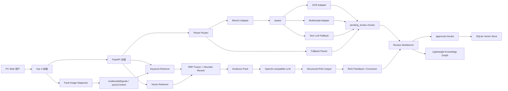

# 最终架构

## 总体链路



## 后端模块

| 模块 | 责任 |
| --- | --- |
| `parser_router` / `mineru_adapter` | 根据文件类型选择 MinerU 或 fallback parser |
| `knowledge.py` | 文档入库、解析产物、图片 assets 分析、知识片段状态机 |
| `review` 接口 | 审核通过、拒绝、修正 revision、同步索引 |
| `retrieval/*` | query context、metadata filter、keyword/vector retriever、RRF、rerank |
| `vector_store.py` | SQLite/JSON/Chroma legacy，sqlite-vec/Qdrant 可选增强与 fallback |
| `evidence_pack.py` | 标准化证据包和结构化 RAG 输出 |
| `services.py` | 维修案例、RAG feedback、审核事件和业务查询 |
| `knowledge_graph.py` | approved-only 轻量知识关系网络，包含案例、chunk 和 approved RAG feedback |
| `provider_policy.py` | LLM/OCR/Embedding/Vector provider 状态与 fallback 记录 |
| `system_status.py` | 系统状态页数据聚合 |

## 向量检索策略

默认：

```env
RAG_VECTOR_STORE=sqlite
RAG_VECTOR_SQLITE_ENGINE=python_scan
RAG_VECTOR_ENHANCER=off
RAG_VECTOR_FALLBACK_LOCAL=on
```

增强：

```env
RAG_VECTOR_SQLITE_ENGINE=sqlite_vec
SQLITE_VEC_EXTENSION_PATH=/path/to/sqlite-vec
```

或：

```env
RAG_VECTOR_ENHANCER=qdrant
RAG_QDRANT_URL=http://127.0.0.1:6333
RAG_QDRANT_COLLECTION=repair_knowledge_chunks
RAG_VECTOR_FALLBACK_LOCAL=on
```

增强不可用时，系统记录 `LAST_FALLBACK["vector"]` 并继续使用本地 SQLite 检索。

## 安全边界

- 正式检索只使用 `approved`。
- Evidence Pack 保留来源和检索诊断字段。
- RAG 输出不得编造参数，证据不足要说明不确定。
- high/critical 风险要求人工复核。
- 跨模态能力口径为“图片语义线索进入文本检索”，不是生产级图文向量检索。
- RAG feedback 默认 `pending_review`，审核通过后只进入轻量知识关系网络，不直接污染 RAG 检索索引。
