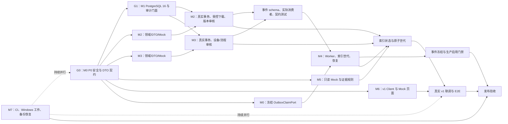

# 后续开发实施方案

> 方案日期：2026-08-28  
> 文档性质：实施路线图，不维护动态实现状态，不改变需求、公共契约或领域事件。  
> 状态与证据唯一入口：[现行需求追踪矩阵](../requirements/current-traceability-matrix.md)。需求语义以 [SRS](../requirements/software-requirements-spec.md) 为准；公共边界以 [M0 公共契约](m0-public-contract.md)、[M1 身份与审计设计](m1-identity-audit-design.md) 和[领域事件目录](event-catalog.md)为准。

## 1. 当前基线与实施目标

现有代码是迁移中的模块化单体：

- 当前可运行的检修业务仍在 `backend/app/main.py` 的旧 `/api` 路由中，使用 `data_store.py` 的 JSON/本地文件、`knowledge.py` 的进程内解析任务、`retrieval/` 和 `rag.py`。
- `/api/v1` 已具备 M0 公共底座，以及 M1 的本地账户、会话、RBAC、审计和迁移代码；M2～M7 仅存在注册表预留或原型参照资产。
- 旧 `frontend/src/App.vue` 与 `api.ts` 只调用旧 `/api`，并非目标的身份、权限和 v1 客户端。

目标不是把旧原型“补丁式生产化”，而是以领域模块和 `/api/v1` 逐步替换它：先关闭安全与事务前置，再形成 M2/M3 的业务事实源、M4 的可靠异步链路、M5 的授权检索/RAG、M6 的前端闭环，最后用 M7 完成可安装、可恢复、可验证的 Windows 基础版。

## 2. 不重复、不冲突的硬性边界

后续工作必须先遵守这些边界，避免重复实现和跨模块耦合：

| 责任域 | 唯一所有者 | 后续工作允许新增 | 禁止重复或跨界的内容 |
| --- | --- | --- | --- |
| 公共 HTTP、错误、分页、readiness、DB 事务、outbox | M0 | `core/`、`db/`、`api/v1` 装配和基础迁移 | 领域模块自行新增错误信封、健康聚合器、DB Engine、outbox Writer 或修改 `main.py` |
| 身份、RBAC、服务主体、审计 | M1 | `domains/identity/`、`domains/audit/`、`api/v1/auth.py`、`users.py`、`audit.py` | M2～M5 自建 session、权限判断、reviewer 参数、actor UUID、审计表或直接读取 M1 Repository/ORM |
| 文档、知识版本、案例 | M2 | `domains/documents/`、`domains/knowledge/`、`api/v1/documents.py`、`knowledge.py` | 扩展旧 `backend/app/knowledge.py`、静态暴露文件、把查询附件写入 M2 私表 |
| 设备、型号、流程 | M3 | `domains/devices/`、`domains/workflows/`、各自 v1 路由 | 修改 M2 表、默认绑定无关流程、在旧种子 JSON 上堆生产功能 |
| 任务、索引、缓存/图谱失效 | M4 | `workers/`、`indexing/`、`api/v1/operations.py` | 用 `BackgroundTasks` 当可靠 Worker、轮询或修改 M2/M3/M5 私表、直接操作 `OutboxEvent` ORM |
| 检索、RAG、查询附件、回答反馈 | M5 | `domains/rag/`、检索适配层、`api/v1/search.py`、`rag.py` | 把 JSON 当目标事实源、绕过 M2/M3 read port、让客户端提交 reviewer/actor、直接写知识表 |
| Web 前端 | M6 | `frontend/src/router/`、`stores/`、`views/`、`services/v1/` | 在 `App.vue`/旧 `api.ts` 继续堆生产功能、导入后端内部模型、解析 HttpOnly Cookie |
| 部署、CI、测试环境、恢复 | M7 | `deploy/`、CI、共享夹具、跨模块 E2E/安全/性能/恢复测试 | 在脚本或测试夹具复制领域逻辑、把旧脚本/Mock 验证当发布证据 |

每次变更前必须阅读 `docs/change-log/INDEX.md`、受影响模块最新记录、相关公开契约和执行时 `alembic heads`。跨模块需求优先增加公开 read port、command port 或事件；不能直接编辑他人私有目录。

## 3. 依赖路线

M2/M3/M5/M6 的 Mock 代码可在 G0/G1 期间并行开展；真实身份、审计、领域写事务和生产事件必须等待相应门禁关闭。

## 4. 分阶段开发计划

### P0：关闭公共安全与可生成契约缺口（M0）

**目的**：使 v1 端点成为后续模块唯一可依赖的安全公共面。

1. 统一处理显式 `HTTPException`、`AppError` 和未捕获异常：除经批准的脱敏 `503` 外，外部 5xx 固定为 `INTERNAL_ERROR`、固定消息、空 `details` 和 request ID。
2. 建立普通日志的集中脱敏策略，拒绝异常原文、请求体、Cookie、令牌、密钥、连接串、绝对路径和未受控堆栈。
3. 为已存在的每个 v1 操作定义具体 success DTO、分页 item DTO、错误 details schema；用 OpenAPI 快照和前端类型测试消除最终契约中的 `Any`。
4. 冻结 `OutboxClaimPort` 的 claim、lease、heartbeat、retry、dead-letter、replay、并发和幂等语义；只提供 M0 公共端口，不实现 M4 业务逻辑。

**测试/退出条件**：新增能在旧实现失败的 5xx、日志和 DTO 回归测试；所有 v1 操作的 OpenAPI 可生成具体类型；不提升 M0 整体状态，直到真实依赖验收完成。

### P1：完成 M1 真实接入前门禁（M1 + M7）

**目的**：让领域写操作获得可审计、可并发验证的真实身份上下文。

1. 将 `AuthenticatedActor` 接入强类型 `AuditEventInput`；按 action 使用 metadata DTO/白名单，禁止领域模块传裸 actor/initiator 或任意请求体。
2. 交付 reviewer eligibility/capacity 的只读端口；以对应审核权限识别至少两名启用、未删除、合格审核人。
3. 补齐 `device:write`、`ops:write` 等稳定权限，连同角色种子、授权测试和迁移兼容一起提交。
4. 让 identity readiness 校验三类服务账户的固定 ID、service key、`auth_source=service`、启用/未删除、无密码和角色策略。
5. 建立显式 opt-in 的 PostgreSQL 16 测试数据库流程：空库/存量升级、受控降级再升级、服务账户种子、审计触发器、bootstrap/activation、事务回滚、并发与中断恢复。

**测试/退出条件**：P0 和 M1 typed-audit 回归测试通过；D2 有独占 PostgreSQL 16 的可复查证据。此后 M2/M3/M5 才可从身份 Mock 切换至真实写事务。

### P2：M2、M3 并行建立领域事实源

**M2：文档、知识、案例**

- 建立 `domains/documents/` 的元数据、内容哈希、适用范围、`DocumentStoragePort`、授权下载和解析任务 command；本地文件、OCR、MinerU 仅作为基础设施适配器。
- 建立 `domains/knowledge/` 的草稿、审核、发布、废弃/替换、单有效版本约束和 `EffectiveKnowledgeReadPort`；案例作为 M2 子域，支持拒绝后新修订和受控附件。
- 新增 `/api/v1/documents`、`/api/v1/knowledge`；使用 M0 信封/游标/ETag/幂等与 M1 当前用户、审计、审核容量门禁。
- 文档解析只创建持久化任务，自动产物一律 `pending_review`，原文件仅通过授权下载。

**M3：设备、流程**

- 建立 `domains/devices/` 的设备类型/型号、停用、UTF-8 CSV 导入和引用保护。
- 建立 `domains/workflows/` 的流程草稿/版本/审核、适用范围、步骤、安全项、验收项和 `EffectiveWorkflowReadPort`。
- 实现确定性流程匹配；无匹配时明确返回无适用流程，绝不套用原型默认流程。
- 新增 `/api/v1/devices`、`/api/v1/workflows`，各自有 readiness contributor、迁移和 PostgreSQL 集成测试。

**实施规则**：在 P1 完成前只实现 M2/M3 contracts、模型、服务和 Mock 测试。P1 完成后，先执行 `alembic heads`，再由指定集成人员串行创建迁移；M2/M3 不共享表、不互写私表。

**退出条件**：领域写入、审核和版本切换在真实事务中可验证；read port 只返回 authorized + effective 内容；受控下载替代旧静态文件；每份迁移提供升级/回滚和数据回填说明。

### P3：实现 M4 的可靠异步与索引一致性

1. 基于 P0 冻结的 ClaimPort，实现 `workers/` 的领取、租约、心跳、有限重试、超时回收、dead-letter、手工重跑和重启恢复。
2. 实现 `indexing/` 的 `IndexGenerationPort`：构建、校验、原子切换索引世代，以及缓存/图谱失效；索引是派生数据，不能反写领域状态。
3. 与 M2/M3/M5 共同完善 `DocumentParseRequested.v1`、知识/案例/流程发布与退役事件：封闭 payload、实际 consumer ID、去重键、顺序、失败责任与重放规则。
4. 只有事件目录冻结版本且通过目标数据库上的提交、重复、乱序、失败恢复、重放验证后，才在对应环境启用 outbox 发布。
5. 增加 `/api/v1/operations`，只提供受权的任务、dead-letter、重试和索引状态，避免暴露路径或原始异常。

**退出条件**：Web 请求不再承担长耗时解析；Worker 宕机后可恢复；索引失败不破坏审核事实；检索不会看到新旧版本混合的索引视图。

### P4：实现 M5 的授权检索、RAG 与反馈

1. 保留 `retrieval/` 中关键词、向量、RRF、重排等可复用算法，但重构为适配层；只从 M2/M3 的授权 effective read port 和 M4 索引读取，不能继续以 JSON 为目标事实源。
2. 交付 `/api/v1/search`、`/api/v1/rag`：query/request ID、证据选择/排除、Evidence Pack、模型/Prompt 版本、耗时和降级原因。
3. 查询图片属于 M5 的 `RagQueryAttachment`；提供受控上传、移除、过期和授权，禁止写入 M2 的文档/案例私表。
4. 在模型生成前应用用户选择的 evidence ID；先执行证据充分性与安全规则，再形成唯一最终回答。Provider 故障时仅返回授权检索/流程与明确降级，不能生成固定模拟诊断或证据。
5. 回答反馈关联原回答、query、模型版本、证据集合；审核后仅调用 M2 的公开修订 command，绝不直接写知识 ORM。

**退出条件**：覆盖授权、有效状态、证据选择、越权拒绝、Provider 故障与安全降级；检索和回答可审计、可复现且不泄露无权限内容。

### P5：实现 M6 的生产前端与受控切换

- 新建 `router/`、`stores/auth.ts`、`views/`、`services/v1/`；旧 `App.vue` 和 `api.ts` 仅保留为迁移期原型。
- v1 Client 统一 `credentials: include`、CSRF、`X-Request-ID`、ETag/`If-Match`、幂等键、错误信封与恢复建议；不读取 HttpOnly Cookie，不传 reviewer/actor/roles 来决定授权。
- 交付登录、强制改密、会话恢复、权限守卫、用户管理、资料/审核、设备/流程、检索/RAG/反馈和任务中心页面。
- 图片识别线索需先展示为可编辑草稿，经用户确认再进入检索；长任务展示 M4 真实状态；高风险、降级、未审核和证据不足不得只靠颜色表达。
- 将 Playwright 固定到 `package.json`/lockfile，实施登录、越权、不得自审、证据选择、解析任务、Provider 降级的核心 E2E。

**切换条件**：每一业务区域的 v1 API、权限、浏览器 E2E、故障恢复均通过后才替换旧页面。禁止旧页面与 v1 写接口混搭；所有替代能力关闭后才能物理删除 `/api`、`/uploads`、`/knowledge`。

### P6：实现 M7 的部署与发布验收

1. 在 `deploy/windows/` 创建 preflight、迁移、受限 provisioning、API/Worker Windows Service、Caddy HTTPS、升级/回滚、备份/恢复与卸载工件。
2. 建立数据库和文件的一致备份与恢复演练，验证 SRS 的 RPO ≤ 24 小时、RTO ≤ 4 小时。
3. 建立 Windows 与 Ubuntu Server 24.04 CI：后端单元/集成、PostgreSQL 16、前端类型检查/构建、锁定的 E2E、迁移、依赖/许可证/密钥扫描。
4. 执行 20 并发 P95、Provider/数据库/Worker/索引故障注入、权限矩阵、代理/CORS/CSRF、日志脱敏和安全降级验收。

**退出条件**：所有适用 MUST 均有关联实现、自动化测试与环境验收证据；`/api/v1/health/ready` 成为代理和服务管理器的唯一生产预检；不存在把 Mock、skip、旧接口或离线 SQL 当发布证据的情况。

## 5. 每个工作包的交付门槛

每个可合并工作包都必须包含：

1. SRS 需求编号、主责模块、协作模块、状态对象与未关闭风险。
2. 版本化 DTO/公开端口；公共变更同步更新 OpenAPI 和消费者契约测试。
3. 领域模型、迁移、实际 head 记录、升级/回滚说明；不修改任何历史 revision。
4. 单元测试、契约测试，以及适用的 PostgreSQL 集成、浏览器 E2E、故障与安全测试。
5. 验证命令、环境、结果、skip 和回滚方式。
6. 一条新增的 `docs/change-log/` 记录及索引登记；动态状态只更新追踪矩阵，事件生命周期只更新事件目录。

## 6. 首个实施迭代的排期顺序

不假设团队规模或日期，首个迭代按以下顺序拆分可独立合并的工作包：

1. **M0-P0**：显式 5xx、普通日志脱敏、v1 DTO 与回归测试。
2. **M1-P0**：typed actor 审计桥接、metadata DTO、reviewer capacity、权限补齐、服务主体 readiness。
3. **M7-D2**：建立 PostgreSQL 16 集成环境并完成 M1 在线迁移/身份事务验收。
4. **M2/M3 并行**：仅提交各自 contracts、领域模型、Mock Repository/Service 与测试，不接真实写路由。
5. **M0/M4 协作**：冻结 ClaimPort 与事件样例，M4 实现可测试的 claim/retry/replay，不直接访问领域私表。

完成这一迭代后，才安全具备 M2/M3 迁移真实领域事实、M4 承担可靠异步任务，以及 M5/M6 切换真实依赖的基础。
