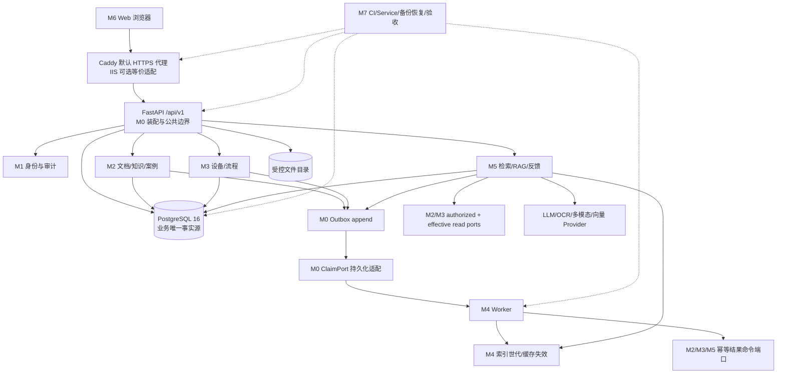
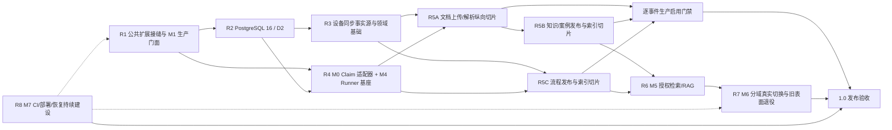

# 统一软件设计与后续开发方案

> 生效日期：2026-08-29<br>
> 文档性质：仓库唯一现行设计文档；同时承载目标架构、稳定公共契约、领域事件目录、部署设计、模块边界和未完成开发路线。<br>
> 需求语义与验收标准：[软件需求规格说明书](../requirements/software-requirements-spec.md)。<br>
> 当前实现状态、验证证据与未关闭问题：[现行需求追踪矩阵](../requirements/current-traceability-matrix.md)。<br>
> 带日期的执行事实与回滚信息：[变更日志索引](../change-log/INDEX.md)。

<a id="document-governance"></a>

## 1. 文档治理与适用边界

### 1.1 单一设计来源

本文件是仓库唯一允许持续修改的现行设计方案。此后不得再创建新的设计 Markdown 文件，也不得为单个模块、接口、事件、部署批次或阶段任务建立第二份设计方案。设计发生变化时，直接修改本文对应章节，并在同一逻辑变更中更新代码/契约测试、现行追踪矩阵和变更日志。

以下材料不构成第二份设计方案：

- SRS：只维护需求语义、优先级和验收标准。
- 现行追踪矩阵：只维护动态状态、证据和阻断项。
- `docs/change-log/`：只保存带日期的执行事实、影响与回滚方式。
- 代码中的 Pydantic/Protocol/迁移、OpenAPI 和版本化事件 schema：属于可执行契约，不是独立设计文档。
- `docs/architecture/`、`docs/project-management/`、`docs/research/`、`docs/submission/`、`docs/superpowers/specs/` 等已带历史警告的材料：只作归档证据，不得恢复为现行设计来源。

### 1.2 维护规则

1. 本文只维护稳定设计和仍未完成的开发路线，不复制测试数量、提交哈希、当前 migration head 或阶段完成百分比。
2. 已完成阶段从“后续开发路线”删除；其仍需长期遵守的行为转入稳定契约章节，不以“已完成计划”继续占用任务列表。
3. 功能状态只在现行追踪矩阵更新。本文出现“必须/禁止”表示设计约束，不表示代码已经实现或验收。
4. 具体事件的版本、生命周期、生产者、实际消费者和启用门禁只修改本文“领域事件目录”章节。
5. 公共 API、错误、DTO、事务、readiness、身份、审计或模块所有权变化，只修改本文对应稳定章节；不得新建补充方案。
6. 每次修改本文前先读取变更日志索引和相关最近记录。若多个分支都需修改本文，由集成人员串行合并；各模块不得在并行分支中复制整份设计。
7. 历史变更日志正文不可重写。旧日志中指向已删除设计文件的路径只解释当时事实；现行开发统一从本文进入。

### 1.3 本次整合替代范围

本文吸收并替代原 `docs/design/` 下的公共契约、M1 设计、事件目录、部署方案、模块计划、API/数据草案和软件设计说明。早期 `/api`、JSON、Mock、Chroma、单页前端及 LoongArch 比赛路线中的已完成或过期计划不进入新路线；仍有价值的 approved-only、可解释检索、Provider 适配和安全降级思想已经转化为本文的目标领域边界。

<a id="current-code-baseline"></a>

## 2. 当前代码基线与迁移边界

本节用于解释设计从哪里继续，不作为动态状态表。精确状态仍只查现行追踪矩阵。

### 2.1 现有目标代码

- M0 已在 `backend/app/core/`、`db/` 与 `api/v1/` 建立配置、请求 ID、统一 v1 信封、具体 DTO、错误/日志脱敏、游标、ETag、可信来源、readiness、幂等、数据库 Session、outbox append 和无 ORM ClaimPort 契约。
- M1 已在 `backend/app/domains/identity/`、`domains/audit/` 与三个 v1 路由建立本地账户、会话、CSRF、RBAC、用户管理、受管服务主体、实例生命周期和审计基础。
- Alembic 已存在 M0/M1 历史迁移；所有后续结构变化只能新增后继 revision，创建前必须执行 `alembic heads`。
- 当前注册表已经为 M2～M5 与 M4 operations 预留路由、模型和 readiness 发现点；未交付模块可在开发环境缺席，已存在模块的内部导入错误必须暴露。

### 2.2 迁移期原型

以下资产只允许用于行为参考、回归夹具或迁移对照，禁止继续承载新的生产功能：

- `backend/app/main.py` 中旧 `/api` 业务路由，以及 `services.py`、`data_store.py`、`knowledge.py`、旧 `rag.py`、旧检索/Provider 适配实现。
- `data/examples/`、`data/knowledge/` 的 JSON、本地文件和样例数据。
- `frontend/src/App.vue`、旧 `api.ts` 与单页组件状态。
- 旧 `/uploads`、`/knowledge` 静态表面和历史脚本/容器材料。

迁移遵循“先建 `/api/v1` 替代能力并完成权限/恢复验收，再切换前端和流量，最后物理删除旧表面”。禁止把旧 JSON 当目标数据库，把 Mock 当生产 Provider，或在旧接口上补写新业务。

### 2.3 目标技术边界

| 层 | 基线选择 | 设计边界 |
| --- | --- | --- |
| Web | Vue 3、TypeScript、Vite、Element Plus | M6 使用路由、认证 store 和 OpenAPI 生成客户端；不读取 HttpOnly Cookie |
| API | FastAPI、当前兼容的 Pydantic 契约层 | 只发布 `/api/v1`；每个 operation 使用具体 DTO；框架大版本升级必须独立评审 |
| 事务 | SQLAlchemy 2、Alembic、PostgreSQL 16 | PostgreSQL 是业务事实源；Repository 不自行 commit/rollback |
| 文件 | 受控数据目录 + 存储端口 | 原文件只能经授权下载；路径不进入响应、普通日志或领域模型 |
| 异步 | 独立 Worker + M0 ClaimPort | 不用 Web `BackgroundTasks` 冒充可靠任务；数据库时钟决定租约 |
| 检索 | 关键词 + 单一可替换向量后端 | 索引/缓存是派生数据；具体后端须经 Windows/Ubuntu 与容量验证后锁定 |
| Provider | OpenAI-compatible 为主、其他适配器可扩展 | 生产失败时只返回授权知识/流程和明确降级，不生成固定模拟诊断 |
| 部署 | Windows Server 2022 默认，Ubuntu 24.04 CI | 平台脚本留在 `deploy/`；领域代码不得依赖盘符、shell 或服务管理器 |

<a id="target-architecture"></a>

## 3. 目标架构与关键数据流

### 3.1 模块化单体拓扑



### 3.2 同步写入流

```text
浏览器请求
  -> M0 request ID / Origin / CSRF / 幂等边界
  -> M1 CurrentUser / 权限 / 审核资格
  -> 领域 Service
  -> 同一调用方事务写领域状态 + 强类型审计 + 必要幂等记录
  -> 仅当事件满足生产启用门禁时追加 outbox
  -> commit
  -> 具体 v1 DTO 响应
```

领域 Repository 不结束事务；M0/M1 Writer 不返回 ORM。失败事务整体回滚，幂等重放不得重复写领域事实、审计或 outbox。

### 3.3 异步解析与索引流

```text
已提交 outbox
  -> M0 持久化适配器原子 claim / lease / fencing
  -> M4 Worker 调用基础设施解析或索引适配器
  -> 通过领域公开幂等命令端口记录结果
  -> 成功确认 / 有限重试 / dead-letter
  -> 构建完整新索引世代
  -> 校验后原子切换
```

Worker 不轮询或直接修改 M2/M3/M5 私表。索引失败不回滚已审核的数据库事实；切换前继续使用旧完整世代或数据库过滤，禁止新旧混合视图。

### 3.4 检索与回答流

```text
设备/故障/用户确认的图片线索
  -> M1 授权
  -> M2/M3 authorized + effective read ports
  -> 关键词/向量召回 + 统一归一化/RRF/可选重排
  -> Evidence Pack（来源、版本、位置、选择/排除原因）
  -> 证据充分性与安全规则
  -> 唯一最终回答
  -> 保存 query、answer、模型/Prompt 版本、证据、耗时和降级原因
```

未审核、已拒绝、已废弃、已替换或无权限内容在召回前过滤。图片/OCR/视觉结果必须先成为用户可编辑线索，确认前不能作为正式证据。

<a id="module-ownership"></a>

## 4. 模块所有权与依赖方向

| 模块 | 独占责任 | 允许新增位置 | 禁止跨界 |
| --- | --- | --- | --- |
| M0 | 公共 HTTP/DTO、错误/日志、配置、事务、迁移装配、readiness、幂等、outbox 公共端口 | `core/`、`db/`、`api/v1/router.py`、`main.py` 装配、基础迁移 | 领域模块不得复制信封、Engine、聚合器、旧表面 guard 或直接改根路由 |
| M1 | 身份、RBAC、服务主体、会话、审计、审核资格 | `domains/identity/`、`domains/audit/`、`api/v1/auth.py|users.py|audit.py`、M1 迁移 | M2～M5 不导入 M1 ORM/Repository，不自建 session、actor、角色或审计表 |
| M2 | 文档、受控文件、知识版本、案例、领域审核 | `domains/documents/`、`domains/knowledge/`、`api/v1/documents.py|knowledge.py`、M2 迁移 | 不扩展旧 `knowledge.py`；查询附件不放入 M2；不提供静态下载 |
| M3 | 设备类型/型号、CSV、流程版本、流程匹配 | `domains/devices/`、`domains/workflows/`、对应 v1 路由与迁移 | 不修改 M2 表；无匹配时不得返回默认流程 |
| M4 | Worker 编排、实际消费者、任务运维 API、索引世代 | `workers/`、`indexing/`、`api/v1/operations.py`、M4 专用迁移 | 不访问领域私表或 outbox ORM；经 M0 ClaimPort 和领域 command port 工作 |
| M5 | 查询附件、授权检索、RAG、回答/反馈 | `domains/rag/`、重构后的 `retrieval/`、`api/v1/search.py|rag.py`、M5 迁移 | 不把 JSON 当事实源，不写 M2/M3 ORM，不让客户端决定 reviewer/actor |
| M6 | Web 路由、认证 store、页面、生成客户端、E2E | `frontend/src/router/|stores/|views/|services/v1/`、`frontend/e2e/` | 不手写重复 DTO，不解析 Cookie，不向旧 `api.ts` 增加生产功能 |
| M7 | PostgreSQL 测试环境、CI、Windows 工件、代理、恢复、安全/性能/E2E | `deploy/`、CI、跨模块验收夹具 | 不实现业务路由或复制领域规则；`operations.py` 归 M4 |

依赖方向只能指向公开端口：业务模块 -> M0/M1 公共端口；M5 -> M2/M3 read port 与 M4 索引端口；M4 -> M0 ClaimPort 与领域幂等命令端口；M6 -> `/api/v1`。需要跨模块能力时先扩展公开端口或事件，不直接导入对方私有实现。

<a id="m0-public-contract"></a>

## 5. M0 公共 HTTP、数据与装配契约

### 5.1 v1 路由和模型发现

根路径固定为 `/api/v1`。M0 固定发现下列相对路由模块，每个模块公开 `router: APIRouter`：

```text
auth        M1
users       M1
audit       M1
documents   M2
knowledge   M2（同时拥有 /cases 子路径）
devices     M3
workflows   M3
search      M5
rag         M5（同时拥有 /feedback 子路径）
operations  M4
```

ORM 发现点固定为：

```text
domains.identity.models  M1
domains.audit.models     M1
domains.documents.models M2
domains.knowledge.models M2
domains.devices.models   M3
domains.workflows.models M3
domains.rag.models       M5
workers.models           M4
indexing.models          M4
```

未交付模块可以缺席；已存在模块内部导入失败必须立即暴露。领域模块不得修改发现注册表、`api/v1/router.py`、`db/models.py` 或 `alembic/env.py`。

<a id="v1-http-contract"></a>

### 5.2 响应 DTO、错误、分页与并发

成功和分页信封固定为：

```json
{"success": true, "data": {}, "error": null, "meta": {"requestId": "..."}}
```

```json
{"success": true, "data": {"items": []}, "error": null, "meta": {"requestId": "...", "nextCursor": null}}
```

- 每个 operation 必须声明命名的具体 success DTO；列表必须绑定具体 item DTO。
- 所有 DTO `extra=forbid`。正式路由禁止未绑定泛型、`Any`、任意映射、空 schema 或自由 object。
- 返回 `JSONResponse` 以设置 Cookie、ETag 或缓存头时，序列化前仍必须用相同 operation DTO 校验。
- OpenAPI consumer-contract 测试必须动态枚举全部已注册 operation，并递归拒绝未封闭 schema；模块自有测试另行精确断言本模块的 operation 名称与模型，避免 M0 测试写死全局操作数量。
- TypeScript 类型只由 M6 从 OpenAPI 生成，生成产物可覆盖但禁止手工编辑；Python DTO 是服务端唯一语义源。

列表请求使用 `limit`（1～100）和不透明 `cursor`。M0 `encode_cursor()`/`decode_cursor()` 使用 `v1.` + URL-safe Base64 JSON；cursor 只隐藏 keyset 位置，不承担签名、授权或过滤，Repository 每页重新应用用户、状态和范围过滤。损坏、超长、未知版本或非对象 payload 返回 `INVALID_CURSOR`。

并发更新使用强 ETag `"v<正整数>"`。缺 `If-Match` 返回 `PRECONDITION_REQUIRED/428`，格式非法返回 `INVALID_PRECONDITION/400`，版本过期返回 `VERSION_CONFLICT/412`；不接受裸整数、弱 ETag、`*` 或列表。

M0 公共错误码：

```text
HTTP_ERROR, VALIDATION_ERROR, INTERNAL_ERROR, DEPENDENCY_UNAVAILABLE,
AUTHENTICATION_REQUIRED, FORBIDDEN, IDEMPOTENCY_KEY_REQUIRED,
IDEMPOTENCY_CONFLICT, REQUEST_IN_PROGRESS, VERSION_CONFLICT,
INVALID_CURSOR, PRECONDITION_REQUIRED, INVALID_PRECONDITION,
TRUSTED_ORIGIN_REQUIRED
```

M1 已登记错误码：

```text
INVALID_CREDENTIALS, ACCOUNT_LOCKED, ACCOUNT_DISABLED, SESSION_EXPIRED,
CSRF_INVALID, SELF_REVIEW_FORBIDDEN, LAST_ADMIN_PROTECTED,
PASSWORD_POLICY_VIOLATION, AUTH_MODE_UNAVAILABLE
```

错误边界固定如下：

- 未单列的 4xx/业务错误使用 `V1ErrorResponse` 且 `details=null`。
- 校验错误使用 `ValidationErrorResponse`，固定消息“请求参数校验失败”；只允许有界 `loc`、公共 `msg`、`type` 和 `ctx.limit_value`，禁止回显 input/body 或原始 validator 上下文。
- readiness 503 使用 `ReadinessErrorResponse` 和第 5.6 节白名单。
- 除已登记的 `DEPENDENCY_UNAVAILABLE/503` 外，显式或未捕获 5xx 统一变为 `INTERNAL_ERROR/500`、固定消息、空 details 和 request ID。
- 新增允许非空 details 的错误码前，必须先在本文、Pydantic、OpenAPI 和消费者测试中冻结专用封闭 schema。

普通日志扩展字段只允许安全标量：

```text
event, request_id, component, operation, outcome, code, method,
status_code, duration_ms, count, attempt, consumer_id, event_id, diagnostic_id
```

其他 `extra` 在合并后失败关闭。异常文本、请求体/载荷/headers、Cookie、令牌、密码、连接串、绝对路径和堆栈不得进入普通日志；禁止用 f-string/`str(exc)` 预先拼接。诊断堆栈只能进入独立、受控、有保留策略的诊断通道。

### 5.3 CORS、可信来源与客户端地址

`APP_ENV` 未设置时只默认 `development`；显式值只允许 `development|test|production`，空值或未知值必须在启动时失败关闭，任何模块不得自行增加环境别名或把未知环境降级为 development。

`APP_TRUSTED_ORIGINS` 是完整 Origin 的逗号列表。开发/测试未设置时只允许本机 Vite 来源；生产必须是明确 HTTPS Origin，禁止 `*`、路径、查询、凭据和空配置被解释为有效。凭据 CORS 使用显式方法/请求头并暴露 `X-Request-ID`、`ETag`。

所有建立或使用 Cookie 会话的浏览器写端点调用 `require_trusted_browser_origin()`：优先 `Origin`，缺失时只取 `Referer` origin，并按 scheme/host/effective-port 精确比较。它不替代登录后的 CSRF。

`ClientAddressResolver` 默认使用直连地址，只有直接上游位于 `APP_TRUSTED_PROXY_CIDRS` 才从右向左解释可信代理链。业务路由不得直接读取 `X-Forwarded-For`。

<a id="idempotency-and-concurrency"></a>

### 5.4 幂等

关键写接口的 `Idempotency-Key` 精确匹配 `^[A-Za-z0-9][A-Za-z0-9._:-]{7,127}$`：总长 8～128，首位为 ASCII 字母/数字，其余只允许字母、数字、点、下划线、冒号和连字符。`APP_IDEMPOTENCY_SECRET` 只在服务器密钥存储提供，用 HMAC-SHA-256 计算包含 actor、方法、路径和 DTO payload 的请求指纹。

同一 PostgreSQL 事务顺序：`request_fingerprint()` -> `IdempotencyService.begin()` -> 领域写/审计/适用 outbox -> `complete()` -> commit。相同 scope/actor/key 和相同指纹返回已存成功响应；同 key 不同指纹返回 `IDEMPOTENCY_CONFLICT`；处理中返回 `REQUEST_IN_PROGRESS`。失败事务回滚预约，不缓存错误响应。领域不得直接写 `idempotency_records` 或创建副本。

### 5.5 Session、事务与迁移

- `new_session()` 拥有 commit/rollback/close；请求依赖和 Repository 不结束调用方事务。
- 数据库配置/连接失败统一映射为脱敏 `DEPENDENCY_UNAVAILABLE/503`，领域路由不得各自形成不同错误。
- 数据库是业务事实源；索引、图谱和缓存可重建。
- 主键与版本 ID 不依赖节点、路径、显示名或当前时间；持久化时间为带时区 UTC。
- 每次创建迁移前执行 `alembic heads`；基于执行时最新 head 新增 revision。禁止修改任何已登记或应用的历史 revision。
- M2/M3 等可并行开发模型，但正式 revision 由指定集成人员串行创建/重定向，避免多头。

`SystemSettingMetadata` 的持久化和公共命令归 M0，只登记非秘密的设置 key、来源类别、格式/版本、安全指纹和更新时间，用于配置追踪与审计；不保存实际密码、token、连接串、Cookie 或 Provider key，也不替代环境变量/密钥存储。M7 provisioning 只能调用 M0 的公开校验/登记命令，不直接写该表；M4 operations 只能读取 M0 提供的封闭状态 DTO。

<a id="readiness-and-legacy-surface"></a>

### 5.6 Readiness 与旧表面

M0 聚合 database、foundation 和以下 contributor：identity、documents、knowledge、devices、workflows、workers、indexing、rag。领域只返回 `ReadinessProbe(healthy, reason, details)`，无权设置/降低 `required`；八类目标模块在 production 均为必需。

`ReadinessDetails` 精确白名单：

| Python/JSON | 允许值 | 所有者 |
| --- | --- | --- |
| `configured` | bool；有 `dialect` 时必须同时存在 | M0 database |
| `dialect` | `postgresql`、`postgresql+psycopg`、`postgresql+psycopg2` | M0 database |
| `mode` | `local`、`oidc` | M1 identity |
| `latency_ms` / `latencyMs` | 非负整数 | 经 M0 评审的依赖 |
| `violations` | `idempotency_secret`、`trusted_https_origins`、`legacy_surface` | M0 foundation |

新增字段/允许值必须同时更新 M0 代码、本文、具体 DTO 和消费者测试。禁止连接串、URL、路径、密钥、异常或任意映射。`live` 只表示进程存活；`/api/v1/health/ready` 是正常生产流量唯一预检。

所有 contributor 的 `reason` 在 `ReadinessProbe` 构造时由 M0 集中去空白和脱敏：长度超过 160、包含换行/NUL/`=`、URL/连接串/敏感标记或 Windows/Unix 绝对路径时替换为固定公共原因。领域不得预先拼接异常，也不得绕过该构造器直接形成 readiness 响应。

`APP_LEGACY_SURFACE_MODE=enabled|loopback|disabled`。development 默认 enabled；production 只允许 disabled。M0 集中阻断旧 `/api`（不含 `/api/v1`）、`/uploads` 和 `/knowledge`；loopback 只信任直连地址。应用层 guard 不替代 M2 受控下载、物理退役和 M7 代理拒绝。

<a id="outbox-append-port"></a>

### 5.7 Outbox append 端口

```python
OutboxEventInput(
    event_type: str,
    aggregate_type: str,
    aggregate_id: str,
    version_id: str,
    request_id: str,
    occurred_at: datetime,
    payload: Mapping[str, JsonValue],
)
OutboxWriter.append(session, event) -> OutboxAppendResult(event_id: str)
```

append 输入不包含 `event_id`；Writer 持久化时生成稳定 ID，只追加到调用方事务，不 commit/rollback、不返回 ORM。存储层 Mapping 只承载事件专用封闭 DTO 序列化后的有限 JSON，不授权任意 payload；禁止请求体、秘密或路径。只有第 8 节事件满足生产启用门禁时，对应环境的生产路径才允许调用 append。

<a id="outbox-claim-port"></a>

### 5.8 Outbox ClaimPort

M4 只能从无 ORM 副作用的 `app.core.ports` 消费：

```python
claim(OutboxClaimInput) -> OutboxClaimResult
renew_lease(OutboxLeaseRenewalInput) -> OutboxLeaseRenewalResult
acknowledge_success(OutboxAcknowledgeSuccessInput) -> OutboxAcknowledgeSuccessResult
schedule_retry(OutboxRetryInput) -> OutboxRetryResult
dead_letter(OutboxDeadLetterInput) -> OutboxDeadLetterResult
replay(OutboxReplayInput) -> OutboxReplayResult
```

冻结语义：

1. `claim` 在单个原子持久化操作中为 `(consumer_id,event_id)` 建立唯一有效租约；批量 1～100，租期 1 秒～24 小时，数据库时钟是唯一到期依据。
2. lease 携带 consumer/event/owner、不透明 token、单调 fencing token、delivery attempt、replay generation、acquired/expires UTC。续租、成功、重试和 dead-letter 比较完整证据。
3. 过期重领生成新 token 并提高 fencing/attempt；heartbeat 只能延长当前未过期租约；成功是终态；retry 释放租约且不早于 available_at；dead-letter 只有匹配 token 的显式 replay 可重开。
4. replay 保留事件 ID/envelope，增加 generation，不再次调用生产者。payload 是有限且深度不可变 JSON；失败元数据只允许稳定 code 和可选 diagnostic ID。
5. 命令以 `(consumer_id, operation_name, operation_id)` 幂等；相同规范输入返回既有结果，不同输入返回 `idempotency_conflict`。
6. 失败状态仅为 `not_found`、`ownership_conflict`、`lease_expired`、`stale_fence`、`invalid_state`、`idempotency_conflict`；拒绝命令不得改状态。

M0 拥有该端口的共享投递/租约/operation ledger 表、PostgreSQL 持久化适配器和通用迁移；M4 拥有 consumer-to-event-type 装配、handler registry、runner/backoff、实际消费者和领域处理器。正式实现适配器前必须冻结 consumer 到 event type 的注入/发现点，避免 M4 读取 M0 ORM。契约冻结不等于数据库适配、Worker 或事件生产启用完成。

<a id="m1-identity-audit"></a>

## 6. M1 身份与审计设计

### 6.1 责任与数据不变量

M1 对外提供 `CurrentUser`、`AuthenticatedActor`、权限依赖、不得自审、审核容量、服务主体解析和只追加审计端口；不拥有任何业务领域数据。

核心表/不变量：

| 表 | 不变量 |
| --- | --- |
| `users` | `auth_source in {local,oidc,service}`；local 有密码无 service key；oidc/service 无本地密码；service 有唯一 key；逻辑删除、版本与 auth_version |
| `roles`/`user_roles` | 角色码唯一；服务主体不可经客户端管理接口修改 |
| `auth_sessions` | 只存 token/CSRF 摘要；绝对/空闲期限；授权时重新检查用户状态和双方 auth_version |
| 登录限流 | 规范化账号主体和可信来源使用独立 HMAC bucket；两维分别生效 |
| `identity_instance_state` | 单例 `identity`；只允许 `uninitialized -> bootstrapped -> active` |
| `audit_events` | 非空 actor、可空 initiator、外键 RESTRICT、只追加；普通接口不能更新/删除/截断 |

审计 metadata 使用数据库 JSON 不等于允许任意映射；每个 action 必须由专用封闭 DTO 构造。

<a id="roles-permissions-review-capacity"></a>

### 6.2 角色、权限与审核容量

```text
technician:
  knowledge:read, workflow:read, case:create, feedback:create
reviewer:
  knowledge:read, workflow:read,
  knowledge:review, workflow:review, case:review, feedback:review
knowledge_manager:
  knowledge:read, workflow:read,
  document:write, knowledge:write, workflow:write, device:write
system_admin:
  iam:users:read, iam:users:write, iam:roles:write,
  ops:read, ops:write
auditor:
  audit:read, ops:read
```

`system_admin` 不隐含审核权，`auditor` 不隐含业务读取。角色并集仍受显式禁止和不得自审约束。

每类审核能力 `knowledge|workflow|case|feedback` 必须通过 `ReviewerCapacityPort` 统计至少两名不同、启用、未删除、非服务主体且有对应权限的用户。M1 只计算资格，不读领域审核表；领域在启用/发布能力前调用固定下限门禁，不能通过参数下调。

### 6.3 本地账户、会话与 OIDC

- 用户名统一规范化；匿名的不存在/密码错/锁定均返回 `INVALID_CREDENTIALS`。
- Argon2id 验证在事务外执行；成功后在短写事务内复验用户仍启用、未删除、凭据/auth_version 未变化，再签发会话。
- 登录失败在独立短事务更新账号和来源 bucket，并以 authentication 服务 actor 写脱敏审计。
- Cookie 保存随机令牌，数据库保存摘要；生产为 `Secure`、`HttpOnly`、`SameSite=Lax`、固定 Path 和 `__Host-` 名称。
- Cookie 写请求先 Trusted Origin，已登录写请求再校验与当前会话绑定的 CSRF。
- 改密、禁用、角色变化、管理员重置在同事务递增 auth_version、撤销会话、写审计和必要幂等记录。
- `must_change_password=true` 时只允许 me、csrf、本人改密和登出。
- 被动活动续期使用独立短事务，不提交调用方事务、不逐次写业务审计。

OIDC 仅在完整 Provider 适配器、授权发起/回调、state/nonce/PKCE、签名/issuer/audience、稳定映射、登出策略、依赖锁定、迁移和 E2E 一起交付后可启用；配置枚举或接口桩不能冒充能力。

<a id="managed-actors-and-provisioning"></a>

### 6.4 受管服务主体和生命周期

| service key | 稳定用户 ID | 用途 |
| --- | --- | --- |
| `authentication` | `20000000-0000-0000-0000-000000000001` | 匿名认证记账 |
| `bootstrap` | `20000000-0000-0000-0000-000000000002` | 激活前一次性引导 |
| `worker` | `20000000-0000-0000-0000-000000000003` | 后台任务/异步延续 |

三者必须是启用、未删除、`auth_source=service`、唯一 service key、无密码且不能建立交互会话。调用方只通过 resolver 获取，不能复制固定 ID 或直接构造 actor。用户发起的异步任务以 worker 为 actor，并保留用户为 initiator。

生命周期：

1. `uninitialized`：本地 CLI 持行锁创建首个 local system_admin，强制改密，推进 bootstrapped；无 HTTP 注册或默认密码。
2. `bootstrapped`：live 可成功、ready 必须失败；只允许第 9.2 节受限 provisioning 表面。
3. `active`：任一启用、未删除、已改临时密码且仍有 system_admin 的本地用户可经受控 CLI 激活；事务外验密、持锁事务内复验并审计。
4. active 后仍须全部 required readiness 健康，代理才放行正常流量；bootstrap 永久拒绝再次执行。

identity readiness 必须验证配置、生命周期及三类服务账户全部不变量，不返回账户 ID、用户名或内部原因。

### 6.5 M1 HTTP 契约

| 路径 | 认证/权限 | 关键规则 |
| --- | --- | --- |
| `POST /auth/login` | 匿名、Trusted Origin | 设置 Cookie，匿名不可枚举，双维限流 |
| `POST /auth/logout` | 当前用户 + CSRF | 撤销当前会话并清 Cookie，显式审计 |
| `GET /auth/me` | 当前用户 | 具体用户/角色/权限/期限 DTO |
| `GET /auth/csrf` | 当前用户 | 当前会话 token |
| `PUT /auth/password` | 当前用户 + CSRF | 本人改密，撤销其他会话，幂等 |
| `GET /users` | `iam:users:read` | 状态过滤、游标、`no-store` |
| `POST /users` | `iam:users:write` + CSRF | 创建临时密码用户，幂等，返回 ETag |
| `PATCH /users/{user_id}` | `iam:users:write` + CSRF | 仅资料字段，必须 If-Match，返回 ETag |
| `PATCH /users/{user_id}/status` | `iam:users:write` + CSRF | 必须 If-Match + 幂等；最后管理员保护 |
| `PUT /users/{user_id}/roles` | `iam:roles:write` + CSRF | 必须 If-Match + 幂等；角色/最后管理员保护 |
| `PUT /users/{user_id}/password` | `iam:users:write` + CSRF | 管理员临时密码重置；必须 If-Match + 幂等 |
| `GET /roles` | `iam:users:read` | 固定角色/权限具体 DTO |
| `GET /audit-events` | `audit:read` | 脱敏游标列表、白名单过滤 |

provisioning 阶段并不因路由存在而全部放行，实际白名单见第 9.2 节。

<a id="typed-audit-facade"></a>

### 6.6 业务公共端口与审计门面

```python
@dataclass(frozen=True)
class CurrentUser:
    id: str
    roles: frozenset[str]
    permissions: frozenset[str]
    session_id: str

@dataclass(frozen=True)
class AuthenticatedActor:
    user_id: str
    kind: ActorKind
    initiator_user_id: str | None = None
```

交互写入从服务端 `CurrentUser` 派生 actor；内部任务只通过 managed actor resolver。API 不接受 actorId、initiatorId、reviewer、角色或权限来决定授权。

目标审计门面：

```python
@dataclass(frozen=True)
class AuditAttribute:
    name: str
    value: JsonScalar | tuple[JsonScalar, ...]

class AuditMetadata(Protocol):
    def to_safe_attributes(self) -> tuple[AuditAttribute, ...]: ...

@dataclass(frozen=True)
class AuditEventInput:
    action: str
    target_type: str
    target_id: str
    result: str
    request_id: str
    actor: AuthenticatedActor
    metadata: AuditMetadata

class AuditWriter(Protocol):
    def append(self, session, event: AuditEventInput) -> AuditAppendResult: ...
```

Writer 将 actor/initiator 映射到数据库列，不 commit/rollback、不返回 ORM。每个 action 使用专用 metadata DTO 和登记的属性名；通用写入/查询层只处理上述封闭属性列表，从而无需在新增领域 action 时扩展 M1 的联合 object schema。禁止请求体、用户名/IP 原文、Cookie、令牌、密码、连接串或路径。需要关联账号/来源时使用独立 purpose 的 HMAC 摘要。

### 6.7 M1 接入门禁

后续生产业务写链在接入真实 M1 前必须同时具备：typed actor 审计门面、事件级 metadata 白名单、reviewer capacity、目标权限码、服务账户 readiness，以及专用 PostgreSQL 上的迁移/约束/触发器/锁/事务/并发/回滚证据。缺任一项时，M2/M3/M5 只使用版本化公共契约 Mock。

<a id="domain-data-api-design"></a>

## 7. M2～M6 领域、数据与 API 设计

### 7.1 跨领域数据原则

目标实体至少包括：

| 模块 | 聚合/实体 | 关键不变量 |
| --- | --- | --- |
| M2 documents | Document、DocumentFile、DocumentScopeMetadata、DocumentParseTask | 内容哈希；原文件受控；解析任务持久化；文件与记录双向追溯 |
| M2 knowledge | KnowledgeItem、KnowledgeVersion、KnowledgeSourceLocation、KnowledgeReviewTask/Decision | 版本不可原地覆盖；同一 item 最多一个 effective；来源/差异/审核完整 |
| M2 cases | RepairCase、RepairCaseVersion、CaseAttachment、CaseReviewTask/Decision | 新修订可追溯；审核前不检索；附件授权 |
| M3 devices | DeviceType、Device | 稳定 ID；类型/型号可停用；被引用项不物理删除 |
| M3 workflows | Workflow、WorkflowVersion、WorkflowStep、WorkflowReviewTask/Decision | 版本审核；步骤顺序；安全项/验收项；最多一个 effective |
| M0 | OutboxEvent、OutboxDelivery、OutboxLease、OutboxOperationLedger、SystemSettingMetadata | 事件 append 与逐消费者投递分离；租约/fencing/operation 幂等；设置元数据不含秘密 |
| M4 | IndexJob、IndexGeneration | Worker 状态经 M0 ClaimPort；索引世代只能验证后原子切换 |
| M5 | RagQuery、RagQueryAttachment、RagAnswer、EvidenceReference、RagFeedback、ProviderCallRecord | 查询附件归 M5；回答关联模型/Prompt/证据；Provider 调用可追踪；反馈不直接改变知识 |
| M1 | User/Role/Session/Audit | 见第 6 节 |

知识、流程和正式案例版本遵循：

```text
draft -> pending_review -> effective
                        -> rejected
effective -> superseded | deprecated
```

通过审核时在同一事务切换新 effective、旧 superseded、写审计，并只在事件通过生产启用门禁的环境追加 outbox。自动解析、OCR、多模态、用户提交或回答修正不得直接 effective。拒绝、废弃、替换必须有原因；受审核对象由各领域拥有自己的审核表，不建立跨领域通用审核 ORM。

所有表使用稳定 ID、带时区 UTC、适用的逻辑删除和版本列。数据库是事实源；文件、索引、图谱和缓存必须能从数据库事实重建。

### 7.2 M2：文档、知识与案例

目标目录和端口：

```text
domains/documents/{models,contracts,repository,service,readiness}.py
domains/knowledge/{models,contracts,repository,service,read_port,readiness}.py
infrastructure/documents/{local_storage,parsers,virus_scan}.py
api/v1/documents.py
api/v1/knowledge.py        # 同时装配 /cases
```

```python
class DocumentStoragePort(Protocol): ...
class DocumentParseCommandPort(Protocol): ...
class EffectiveKnowledgeReadPort(Protocol): ...
class EffectiveCaseReadPort(Protocol): ...
class KnowledgeRevisionSubmissionPort(Protocol): ...
```

设计规则：

1. 上传校验扩展名、MIME、空文件、安全文件名、资源上限和内容哈希；默认上限与可下调策略以 SRS 为准。
2. 原文件写入程序目录外的受控存储，只通过鉴权下载 API 返回流，不返回物理路径或静态 URL。
3. Web 请求只创建持久化解析任务；解析由 M4 Worker 调用基础设施适配器。状态至少为 queued/running/succeeded/failed/cancelled，失败只公开稳定摘要。
4. PDF/TXT/Markdown/DOCX/PPTX/XLSX/常见图片只有在基线环境能抽取可审核内容时才报告成功；依赖缺失标记 `needs_parser`，不生成可信片段。
5. 自动片段全部 pending_review，保留文档/页码/章节/Provider/版本和内容哈希。
6. 知识和案例使用各自版本、审核决定和单 effective 约束；拒绝后基于旧版本创建新修订，不原地改回 pending。
7. `EffectiveKnowledgeReadPort`/`EffectiveCaseReadPort` 只返回调用方有权访问且 effective 的封闭只读 DTO，供 M5 消费。
8. 发布/退役/解析只通过第 8 节事件和公开命令端口协作；M4 不直接写 M2 表。

路由所有权为 `/documents*`、`/knowledge*`、`/cases*`。具体 operation 在实现工作包中先写本文语义、Pydantic DTO 与 OpenAPI 消费者测试，再写路由；禁止复用旧 `/api/knowledge` 字段作为隐式契约。

### 7.3 M3：设备与作业流程

目标目录和端口：

```text
domains/devices/{models,contracts,repository,service,readiness}.py
domains/workflows/{models,contracts,repository,service,read_port,readiness}.py
api/v1/devices.py
api/v1/workflows.py
```

```python
class DeviceCatalogReadPort(Protocol): ...
class EffectiveWorkflowReadPort(Protocol): ...
class WorkflowMatchPort(Protocol): ...
```

设备类型/型号由知识管理员维护，支持 UTF-8 CSV 导入、停用和引用保护。CSV 先形成逐行校验结果，整体导入的事务/部分成功策略必须在 operation DTO 中明确，不得静默跳过坏行。

流程版本包含适用设备、故障类型、检修等级、工具、准备、顺序步骤、安全警告和验收标准，复用知识版本审核规则。匹配是确定性规则并返回匹配依据；没有匹配时明确返回空，不使用旧种子默认流程。只读端口仅返回 authorized + effective DTO。

路由所有权为 `/devices*`、`/workflows*`；发布/退役事件和索引更新按第 8 节执行。

### 7.4 M4：Worker、索引与运维状态

目标目录：

```text
workers/{contracts,models,repository,runner,handlers,readiness}.py
indexing/{contracts,models,repository,service,readiness}.py
api/v1/operations.py
```

M4 runner 只依赖 M0 ClaimPort，按 consumer registry 把冻结 event type 分派到明确 handler。handler 使用 M1 worker actor，并只调用生产者公开的幂等完成/失败命令端口。任务具有有限重试、退避、超时、取消、dead-letter、手工重放和重启恢复；普通日志不记录异常原文。

`IndexGenerationPort` 提供 build/validate/activate/retire/status。构建写入新世代，校验完整性和授权元数据后原子激活；失败保留旧世代。缓存和轻量关系视图按同一有效版本/世代失效，不反写领域状态。

`/api/v1/operations` 归 M4，提供 `ops:read` 状态与 `ops:write` 重试/重放。FR-OPS-02 的数据库、文件、Worker、解析、索引和 Provider 汇总只能消费各所有者的封闭状态端口：M0 database/readiness、M2 storage/task、M4 worker/index、M5 provider；禁止为汇总查询其他模块私表或返回路径/异常。

### 7.5 M5：授权检索、RAG、查询附件和反馈

目标目录：

```text
domains/rag/{contracts,models,attachments,evidence,safety,service,readiness}.py
infrastructure/rag/{providers,attachment_storage,vector_backend}.py
retrieval/                 # 重构为适配层
api/v1/search.py
api/v1/rag.py              # 同时装配 /feedback
```

M5 只消费 M2/M3 的 authorized + effective read port 与 M4 当前索引世代，不查询其他领域 ORM。检索至少保留关键词召回，在单一向量后端可用时做统一归一化、融合和可选重排；每条结果包含稳定 evidence ID、来源、版本、位置、命中原因和过滤/排序信息。

查询图片归 `RagQueryAttachment` 和 `QueryAttachmentStoragePort`，不写 M2 文档/案例。OCR/视觉观察先成为用户可编辑线索，用户确认/删除后才进入检索；它本身不是正式证据。

RAG 在模型调用前应用用户选择/排除的 evidence ID，执行权限、证据充分性、Prompt Injection 和安全规则，然后形成唯一最终回答。保存 query ID、request ID、模型/Prompt 版本、证据集合、耗时和降级原因，不保存密钥。生产 Provider 失败时仍可返回授权关键词检索/流程和明确不可用状态，禁止 mock/hash/固定模拟内容进入 query、evidence、index 或审核对象。

`ProviderCallRecord` 归 M5，只记录与 query/answer 关联的 Provider/模型标识、Prompt 版本、开始/结束时间、耗时、结果码、允许的 token 计数和可选 diagnostic ID；不保存 Provider key、原始异常、未筛选请求体或未授权的完整 Prompt/响应。M7/M4 如需汇总，只消费 M5 封闭状态端口，不查询该表。

反馈关联原回答、query、模型版本和证据，默认 pending_review；审核通过需要形成知识修订时只调用 M2 `KnowledgeRevisionSubmissionPort`。

路由所有权为 `/search`、`/rag*`、`/feedback*`。

### 7.6 M6：Web 前端

目标结构：

```text
frontend/src/router/
frontend/src/stores/auth.ts
frontend/src/views/
frontend/src/services/v1/
frontend/src/generated/       # 生成物，不手改
frontend/e2e/
```

M6 选择并锁定一个 OpenAPI TypeScript 生成器，固定生成命令和版本。所有共享 DTO 从 OpenAPI 生成，手写代码只包含 UI view model、交互状态和适配函数；生成目录整体可重建。后端 schema 变化与生成产物/类型消费测试同批提交。

v1 客户端统一 `credentials: include`、CSRF、request ID、ETag/If-Match、幂等键、游标和错误信封。前端不读取 Cookie、不发送 reviewer/actor/roles 决定授权。

页面覆盖登录、强制改密、会话恢复、权限守卫、用户/角色、文档/审核、设备/流程、检索/RAG/反馈和任务中心。主流程按输入、依据、指引、复核、经验五步展示；长任务使用 M4 真实状态；降级、未审核、证据不足和高风险不能只靠颜色表达。

每个业务区域只有在对应 v1 API、权限、错误恢复和浏览器 E2E 通过后才切换。旧页面和 v1 写接口不得混搭；全部替代后再物理删除旧 `App.vue` 流程与旧表面。

<a id="event-catalog"></a>

## 8. 领域事件目录

本节是具体事件、版本、生命周期、生产者/消费者和生产启用规则的唯一设计来源。新增或修改事件只能原位更新本节、可执行 schema、生产者/消费者契约测试、追踪矩阵和变更日志，不再新建事件文档。

### 8.1 生命周期

| 生命周期 | 含义 | 生产约束 |
| --- | --- | --- |
| 提议 | 可用于设计、schema 样例和 Mock；契约未闭合 | 禁止生产代码发布 |
| 已冻结 | 生产者、实际消费者、payload、事务触发点、幂等/顺序、恢复、权限/隐私和兼容测试均登记 | 可完成受控实现/测试；不自动允许生产发布 |
| 已废弃 | 消费者迁移、积压处理、重放工具和回滚安排已完成 | 新生产者禁止发布；保留期内按迁移方案处理 |

“预期消费者”只是方向。实际消费者必须登记稳定 production consumer ID、所有模块、可定位 handler、公共端口、去重键、重放规则和失败责任；Mock、接口草稿或模块名不算实际消费者。

<a id="event-production-enablement-gate"></a>

### 8.2 生产启用门禁

事件只有同时满足以下四项，才允许指定环境的生产者发布：

1. 生命周期为已冻结，并登记符合要求的实际消费者。
2. M0 ClaimPort 持久化适配及消费者依赖的 claim/lease/retry/dead-letter/replay/并发语义已经实现。
3. producer/consumer 契约测试及目标数据库提交、重复、乱序、失败恢复和重放集成验证通过。
4. 现行追踪矩阵登记该生产者—消费者的集成证据；新变更日志写明启用环境、停发/回滚方式和责任边界。

缺任一项时只允许开发、Mock 或受控测试，生产发布保持关闭。若解析、索引、缓存或任务一致性依赖该事件，对应生产业务入口也必须关闭，不能省略 outbox 后把结果称为同步降级。其他章节只引用本门禁，不复制或缩减条件。

### 8.3 Append 与投递 envelope

生产者调用输入字段为 `event_type`、`aggregate_type`、`aggregate_id`、`version_id`、`request_id`、带时区 UTC `occurred_at` 和封闭 DTO 序列化的 payload。事件名格式 `<Domain><Fact>.v<major>`；major 变化表示不兼容。

Writer 生成 `eventId`。持久化/投递 envelope 才包含：

```text
eventId, eventType, aggregateType, aggregateId, versionId,
requestId, occurredAt, payload
```

生产者不得生成/复用 eventId。payload 禁止密钥、令牌、Cookie、密码、连接串、绝对路径、任意 metadata 或未筛选请求体；每个事件必须链接可执行 schema 与正反例测试。

### 8.4 主体、事务与适用范围

| 操作 | 主体/审计 | outbox |
| --- | --- | --- |
| M2/M3/M5 可观察领域事实变化 | HTTP 用 CurrentUser 派生 actor；异步用 worker actor 并保留 initiator；领域状态、审计、必要幂等同事务 | 仅事件通过生产启用门禁的环境追加 |
| M5 query/answer/feedback 等无已启用事件写入 | 同上，记录审计/调用事实 | 不发布业务 outbox |
| M1 安全状态变化 | 已认证交互 actor + 安全审计 | 仅存在并启用相应安全事件时追加，不为形式统一发布 |
| 会话签发/注销 | 认证用户 + 独立短事务 + 适用审计 | 不发布业务 outbox |
| 被动续期、登录限流记账 | 当前/认证服务 actor + 日志/指标或安全审计 | 不发布业务 outbox；续期不逐次审计 |
| bootstrap | bootstrap 服务 actor，仅激活前，独立 request ID/审计 | 不属于正常生产流量事件 |
| heartbeat/lease/retry | worker actor + 任务上下文 + 日志/指标 | 不发布业务事件；明确登记的领域结果事件除外 |

调用方不得提交裸 actor/initiator/reviewer。没有实际消费者、幂等和重放语义的写操作不得为“架构统一”发布事件。

<a id="registered-events"></a>

### 8.5 事件登记

当前登记事件均为“提议”，预期消费者不构成实际消费者或生产授权：

| 事件 | 生产者 | 预期消费者 | 冻结前必须补齐 |
| --- | --- | --- | --- |
| `DocumentParseRequested.v1` | M2 documents | M4 worker | 文件引用白名单、解析配置版本、去重、取消/失败、consumer ID、重放 |
| `KnowledgePublished.v1` | M2 knowledge | M4 indexing/cache | 有效版本切换点、索引世代、consumer ID、幂等/重放 |
| `KnowledgeRetired.v1` | M2 knowledge | M4 indexing/cache | 退役版本、派生失效、consumer ID、幂等/重放 |
| `RepairCasePublished.v1` | M2 cases | M4 indexing/cache | 审核决定、有效修订、附件引用、consumer ID、幂等/重放 |
| `RepairCaseRetired.v1` | M2 cases | M4 indexing/cache | 废弃/替换、派生失效、consumer ID、幂等/重放 |
| `WorkflowPublished.v1` | M3 workflows | M4 indexing/cache | 有效版本、设备适用范围、consumer ID、幂等/重放 |
| `WorkflowRetired.v1` | M3 workflows | M4 indexing/cache | 退役版本、匹配缓存失效、consumer ID、幂等/重放 |

事件冻结必须补齐：唯一事务触发点；聚合/版本；实际 consumer ID 和 handler；字段类型、可空、敏感性、大小及正反例；producer dedup/consumer idempotency；同聚合顺序、重复/乱序；claim/retry/dead-letter/replay/积压；actor/initiator、权限、审计、保留/隐私；major 兼容和消费者迁移窗口；生产者/消费者契约测试。

### 8.6 事件变更顺序

1. 生产者提出版本化 schema、事务触发点和回滚；M4 提交 consumer ID、handler、幂等、重放和失败责任。
2. M0 评审 append/envelope/ClaimPort，M1 评审 actor/initiator/audit，领域所有者评审权限/隐私。
3. 同一逻辑变更更新本节、可执行 schema、样例、双方契约测试和变更日志。
4. 契约闭合后才从提议改为已冻结；冻结不自动提升功能状态或启用生产。
5. 不兼容变化新增 major 并保留迁移窗口；禁止原地改变已冻结字段语义。
6. 废弃前处理全部消费者、积压、重放、保留和回滚。

<a id="deployment-design"></a>

## 9. 部署、provisioning、运维与恢复设计

<a id="windows-topology"></a>

### 9.1 Windows 默认拓扑

```text
Browser
  -> Caddy HTTPS reverse proxy（默认参考；IIS 需独立等价验收）
     -> API Windows Service（初期单进程）
        -> PostgreSQL 16
        -> 程序目录外受控数据目录
     -> Worker Windows Service
```

验收基线为 Windows Server 2022 x64、Python 3.11.x、PostgreSQL 16。API/Worker 使用独立最小权限系统账户；程序目录只读，配置、数据、日志和备份分离。迁移是安装/升级中的一次性步骤，不在每个 Service 启动时自动运行。客户提供受支持系统、数据库、证书及可选企业 Provider；安装程序不静默修改客户 PostgreSQL、代理、证书或身份系统。

<a id="restricted-provisioning"></a>

### 9.2 受限 provisioning

`bootstrapped` 时 `/health/live=200`、`/health/ready=503`。代理只允许本机或明确可信管理来源访问首次设置页/静态资源，以及：

```text
/api/v1/auth/login
/api/v1/auth/me
/api/v1/auth/csrf
/api/v1/auth/password
/api/v1/auth/logout
```

其他业务 API、下载和旧表面继续阻断。合格本地 system_admin 完成改密后运行 activation CLI；只有 lifecycle=active 且完整 ready=200，代理才开放正常流量。install/status 在此之前必须报告“provisioning 未完成”，不得报告生产就绪。

### 9.3 跨平台和配置

Windows/Ubuntu 复用同一 `APP_*` 配置、`get_settings()`、readiness、Alembic、bootstrap/activation 和 API 语义。路径由 `pathlib`/配置端口处理；PowerShell、shell/systemd、注册表和盘符只存在部署适配层。Ubuntu Server 24.04 CI 是基础版强制门禁，Linux 生产包/systemd/OCI 是可选交付。

生产不变量包括 PostgreSQL 必需、强密钥、Secure `__Host-` Cookie、明确 HTTPS Origins、legacy disabled 和全部 required contributor 健康。受控数据目录可写性由 M7 preflight 检查；部署包装不得另建健康逻辑。

<a id="deployment-artifacts"></a>

### 9.4 M7 Windows 工件

```text
deploy/windows/
  config/application.env.example
  proxy/caddy/Caddyfile.example
  proxy/iis/README.md
  preflight.ps1
  migrate.ps1
  bootstrap-admin.ps1
  install.ps1
  start.ps1
  stop.ps1
  status.ps1
  upgrade.ps1
  rollback.ps1
  backup.ps1
  restore.ps1
  diagnose.ps1
  uninstall.ps1
  service/
```

- preflight 检查版本、端口、配置存在性、密钥强度和数据目录，只输出脱敏状态。
- migrate 用临时迁移账户；API/Worker 使用最小 DML 账户。
- install/upgrade/rollback 变更前一致备份数据库和文件，并记录应用版本/实际 migration head；不可逆数据迁移不自动 downgrade。
- Service 不使用 `--reload`，不调用历史 Anaconda 脚本，不在启动时生成配置或迁移。
- backup/restore 同时覆盖数据库和文件，恢复后检查引用完整性、重建派生索引并执行核心烟测。

<a id="integration-release-gates"></a>

### 9.5 集成与发布门禁

| 层 | 必须验证 |
| --- | --- |
| PostgreSQL | 空库/存量 upgrade、受控 downgrade/re-upgrade、种子、约束/索引/触发器、行锁、事务、并发、回滚、中断恢复 |
| M0/M1 | 5xx/日志、DB 断连、代理链、Origin/CSRF、双桶限流、bootstrap/activation、服务主体、审计不可变 |
| 领域 | 版本切换、授权下载、文件追溯、审核容量、outbox 原子性、任务恢复、索引世代、Provider 故障 |
| 浏览器 | 登录/强制改密/权限、跨源 Cookie、ETag、五步主流程、长任务、越权、降级、provisioning |
| 部署 | Service 自动重启、HTTPS、备份恢复、升级/回滚/卸载、外部 ready 探测、日志采集/保留 |
| 发布 | Windows/Ubuntu CI、锁定依赖、SAST/SCA/密钥/许可证扫描、20 并发性能、故障注入、核心 E2E |

破坏性数据库测试必须显式 opt-in，并使用一次性或人工确认独占的数据库；`_test` 后缀只是第二道保护，不能证明独占。测试失败日志不得输出密钥、token、连接串或绝对路径。Mock、skip、离线 SQL、TestClient、页面构建或旧原型烟测不属于真实集成证据。

备份恢复目标为 RPO 不超过 24 小时、RTO 不超过 4 小时；至少每季度演练。性能按 SRS 固定硬件、数据规模、10 分钟持续负载、成功率和 P95 口径执行，外部模型延迟单独报告。

<a id="remaining-roadmap"></a>

## 10. 仅包含未完成工作的后续开发路线

本路线从当前稳定公共边界继续，已结束阶段不再列入。第 5 节既有 M0 行为是所有工作包的持续非回归约束，不是待重复实现的任务。



### R1：公共扩展接缝与 M1 生产门面（M0 + M1）

1. M0 把全局 OpenAPI 契约测试改为动态遍历全部 v1 operation；M0/M1 各自测试精确拥有的路由/模型，取消“全仓永远固定某个操作数量”的扩展冲突。
2. 将 `v1_success`、`v1_page` 和 `identity_json_response` 的具体 `response_model` 改为必填，移除生产代码回退到未绑定泛型或 `object` 的路径；新增 operation 缺少闭合模型时必须在装配/测试阶段失败。
3. 冻结并实现 `AuthenticatedActor -> AuditEventInput`；领域 action 使用专用 metadata DTO，M1 公共审计表示改为封闭 `AuditAttribute{name,value}` 列表或等价闭合结构，避免每新增领域字段就修改 M1 联合响应模型。
4. 实现数据库校验的 `ManagedActorResolver`；service 用户禁止交互会话/普通角色，Session 解析显式拒绝 service 用户，identity readiness 复用同一账户不变量检查。
5. 实现 reviewer eligibility/capacity 端口和四类能力门禁。
6. 增加 `device:write`、`ops:write` 及授权测试。权限当前为代码枚举/角色映射；若数据库 schema 未变化不得为了形式创建迁移，真实 PostgreSQL 只验证种子兼容。
7. 冻结 consumer-to-event-type registry 的所有权和装配点，为 R4 保持 M4 与 M0 ORM 解耦。
8. 将 append 单元测试中的未版本化生产式事件名改为明确标注的 `SyntheticTestEvent.<major>` 占位名或目录中的精确版本名；synthetic 名不得登记为生产事件，测试夹具不得形成第二套事件目录或被当作生产消费者证据。
9. 由 M0 冻结并实现不含秘密的 `SystemSettingMetadata` Repository/公共命令；若新增表则只基于执行时 head 创建一个后继 revision，并纳入 R2 在线验证。M7 不得另建部署设置表。

退出条件：旧实现会失败的 typed audit、metadata、服务主体、service session、审核容量、权限和动态 OpenAPI 回归测试通过；公共 DTO/端口与消费者测试同批更新；不创建 M2～M5 真实写路由。

### R2：专用 PostgreSQL 16 在线验收（M7 + M0/M1）

M7 可与 R1 并行准备显式 opt-in、一次性/独占数据库和最小权限账户；完整验收等待 R1 实现合入。执行实际 head 的空库/存量 upgrade、受控 downgrade/re-upgrade，验证服务账户、生命周期、审计触发器、双桶、Session、幂等、`SystemSettingMetadata` 不含秘密的约束、事务隔离、并发禁用/改密/角色变化、数据库断连/恢复和 bootstrap/activation。

遗留组合限流模型/表 `LoginThrottle` / `login_throttles` 从本阶段起禁止新引用。D2 先检查真实存量、Repository 使用面和回滚影响；仅在确认安全且确有清理价值时，由 M1 基于执行时 head 新增独立 revision 删除，绝不改写 `0003`。若证据不足则保留物理表并记录弃用，不以“清理旧名义”阻塞生产门禁。

退出条件：记录环境、代码基线、实际 head、命令、结果、skip 和限制；将精确状态对象提升到集成层，但不外推为浏览器、代理或整个 M1 完成。

### R3：设备同步事实源与领域基础（M3 主责，M2 协作）

R1/R2 完成前，M2/M3 可各自在私有目录开发 contracts、纯领域 Service、Repository Mock 和测试，不接真实身份写链、不开放生产写路由、不创建相互竞争的迁移。门禁完成后先交付设备类型/型号、设备停用、CSV 导入及公开 `DeviceReferencePort`，形成文档与流程共同依赖的稳定设备引用来源；M2 在本阶段只冻结文档存储/解析 command、知识版本和授权读取端口，不提前发布异步事件。

生产接入遵循：

- M3 的设备写事务接入 CurrentUser、typed audit、幂等和 PostgreSQL 约束；设备同步不借用尚未闭合的领域事件。
- M2/M3 只通过稳定 ID 和公开端口关联，不共享表、不互写私表，也不向 API 暴露本地存储路径。
- 每次结构变化先重查当时 `alembic heads`，由迁移负责人串行创建后继 revision。
- 文档解析、知识/案例发布和流程发布的生产入口分别留到 R5A/R5B/R5C 与实际消费者同包启用。

退出条件：目标 PostgreSQL 上验证设备约束、停用/引用保护、CSV 原子性、事务回滚和公开引用端口；每个已开放列表有稳定排序/过滤/cursor 和具体 DTO。M2/M3 的 Mock 契约不得被记录为真实领域事实源证据。

### R4：M0 Claim 适配器与 M4 Runner/索引基座

1. M0 新增通用 delivery/lease/operation ledger 表、ClaimPort PostgreSQL 适配器和迁移，验证数据库时钟、原子 claim、fencing、operation 幂等和多进程并发。
2. M4 实现 registry/runner/backoff/dead-letter/replay、明确 handler 和 `/operations`；只经 ClaimPort，不访问 outbox ORM。
3. M4 建立 `IndexGenerationPort` 和完整世代 build/validate/activate/recover。
4. composition root 将 M4 提供的 consumer-to-event-type 订阅描述和 handler registry 注入 Runner；M0 不反向依赖 M4 事件列表，M4 不导入 `app.db`。

退出条件：在尚未启用领域事件的前提下，目标 PostgreSQL 已证明多 Worker 原子 claim、数据库时钟、fencing、租约过期回收、operation 幂等、重试/dead-letter/replay 和重启恢复；空 registry 能安全运行。索引失败保留旧世代，领域私表无跨模块写入。基座完成本身不构成任何领域事件的生产启用证据。

### R5A：文档上传/解析纵向切片（M2 + M4）

同一工作包交付受控文件存储、授权下载、文档元数据、持久化解析 operation、`DocumentParseRequested.v1` 生产者、唯一 consumer/handler，以及解析完成/失败 command。写事务同时闭合身份、typed audit、幂等和 outbox；禁止用 `BackgroundTasks`、进程内队列或扫描 M2 私表替代可靠消费。

退出条件：事件 schema、consumer ID、handler、去重/顺序/重放/失败责任均已冻结；目标 PostgreSQL 和真实 Worker 证明提交后投递、回滚不投递、重复安全、崩溃恢复、失败可诊断与授权下载。只有本事件满足第 8.2 节全部门禁后才启用文档解析生产入口。

### R5B：知识/案例发布与索引纵向切片（M2 + M4）

在 R5A 的受控文档与解析结果上交付知识/案例版本、审核容量、不得自审、发布/退役、authorized/effective read ports，并逐个闭合 `KnowledgePublished.v1`、`KnowledgeRetired.v1`、`RepairCasePublished.v1`、`RepairCaseRetired.v1` 及其索引 consumer。索引构建使用不可变 generation，验证后原子激活；失败继续服务旧 generation。

退出条件：版本切换、容量不足、事务回滚、来源追溯、authorized/effective 过滤和索引重建均在目标环境通过；每个事件独立满足门禁后才启用对应写入口，不以同模块另一个事件的证据代替。

### R5C：流程发布与索引纵向切片（M3 + M4）

在 R3 设备事实源上交付流程版本审核、deterministic match、authorized/effective read ports，并逐个闭合 `WorkflowPublished.v1`、`WorkflowRetired.v1` 及其索引 consumer。该切片可与 R5B 并行开发私有代码，但 Alembic revision 仍由迁移负责人串行落地，共享 Runner/索引契约由 M4 单点维护。

退出条件：流程状态机、不得自审、设备匹配、事务回滚、权限过滤、重复/乱序/重放和索引 generation 切换通过目标环境验证；未通过门禁的流程发布入口保持关闭。

### R6：M5 授权检索、RAG 与反馈

先用版本化 read port Mock 实现 Evidence Pack 与安全规则；R5B/R5C 的 authorized/effective read ports 和索引 generation 就绪后切换真实依赖。实现查询附件确认、关键词必备路径、单一向量后端、融合/重排、证据选择、唯一回答、`ProviderCallRecord`、安全降级和反馈审核到 M2 修订命令。

退出条件：权限/effective 违规数为零；Provider、索引和向量故障时不产生模拟正式内容；query/answer 可审计复现；反馈不直接写知识表；性能和评测口径可重复。

### R7：M6 生成客户端、分域真实切换与旧表面退役

生成器选择/锁定和当前 M1 客户端可在 R1 期间并行；后续 schema 只重新生成，不手写第二套 DTO。按后端交付顺序接入身份、设备、文档/审核、知识/流程、检索/RAG/反馈、operations 页面，每个区域先 Mock、再真实联调、再 E2E 后切换旧页面。

旧 `/api`、静态 `/uploads`/`/knowledge`、JSON 事实源及旧页面在替代能力、数据迁移、回滚和真实 E2E 完成前一律冻结新增功能但保留兼容；全部区域切换后由一个专门退役工作包统一物理删除，避免各模块边开发边拆旧入口。

退出条件：锁文件包含生成器/E2E 依赖；登录/强制改密/会话恢复/权限/越权、证据选择、解析任务、降级、request ID 恢复建议和可访问性测试通过；新旧写入口不混用，旧表面物理退役有数据迁移与回滚证据。

### R8：M7 持续交付与发布验收

从 R1 开始持续建设 Windows/Ubuntu CI、依赖锁定/扫描、PostgreSQL 服务、Caddy/Service/provisioning、备份恢复、日志/指标和故障/性能夹具。领域 API 未就绪时只搭环境，不复制业务 Mock 到发布验收。

最终退出条件：SRS 的所有适用 MUST 均有关联实现、迁移、自动测试和真实环境证据；三条核心 E2E、恢复演练、20 并发性能、Provider/DB/Worker/索引故障、安全和旧表面物理退役通过，方可声明 1.0 发布。

<a id="conflict-control"></a>

## 11. 并行开发与冲突控制

### 11.1 共享热点

| 热点 | 唯一编辑者/合并规则 |
| --- | --- |
| `main.py`、v1 根 router、readiness registry、公共 DTO/错误 | M0；领域通过预留模块发现，不直接编辑 |
| M1 public identity/audit contracts | M1；消费者先用版本化 Mock，变更同批更新消费者测试 |
| Alembic head | 指定集成人员串行；每个 revision 创建前重查 head；不改历史 revision |
| Outbox delivery/lease 表与适配器 | M0；M4 只依赖 ClaimPort |
| 事件登记 | 生产者 + M4 + M0/M1 同一逻辑变更，原位修改第 8 节 |
| OpenAPI Python DTO | 各后端模块拥有自己的 operation DTO；M0 维护公共基类/动态门禁 |
| TypeScript generated | M6 唯一生成；领域模块不提交手写镜像类型 |
| 本统一设计文件 | 对应模块起草、指定集成人员串行合并；禁止创建旁路设计文件 |

### 11.2 并行规则

1. M2/M3 在各自目录并行，迁移串行；cases 只归 M2，query attachments 只归 M5，operations API 只归 M4。
2. M4 generic runner 可与 M2/M3 模型并行，但实际 handler 必须等待生产者 command port/schema；不得用轮询私表临时绕过。
3. M5/M6 可用版本化 Mock 并行；Mock 只在测试/开发层，不能进入生产 Provider、索引、审核或发布包。
4. 公共契约变更先增加兼容版本或迁移窗口，再更新消费者；禁止原地改已冻结字段含义。
5. 新路由必须通过动态全局 OpenAPI 门禁和本模块精确 operation 测试，不修改 M0 的全仓固定计数。
6. generated client、迁移、事件 schema 均只维护一个源；重复手写实现不得合并。
7. 需要修改他人私有目录时暂停实现，先在本文对应章节定义公开 read/command/event port，并由所有者实现。

### 11.3 合并顺序

```text
契约/Mock -> 所有者实现 -> 消费者契约测试 -> 数据迁移（如需）
-> 模块集成 -> 真实依赖验收 -> 状态矩阵/日志 -> 上游功能切换
```

事件另需“提议 -> 实际消费者 -> 冻结 -> 集成证据 -> 环境启用”；前端另需“OpenAPI -> 生成 -> 类型测试 -> Mock 页面 -> 真实 E2E -> 切流”。跳过任一步都不能用后续步骤反向证明前置完成。

<a id="work-package-acceptance"></a>

## 12. 每个工作包的交付门槛

每个可合并工作包必须包含：

1. 需求 ID、主责/协作模块、状态对象、依赖和仍未关闭风险。
2. 对现有代码、DTO、端口、迁移、事件和最近变更日志的重复/冲突检查。
3. 公开行为使用版本化、封闭、可执行契约；所有消费者测试同批更新。
4. 数据变化提供基于执行时 head 的新迁移、upgrade/downgrade 或不可逆说明、回滚/恢复方式；不改历史 revision。
5. 适用的单元、契约、PostgreSQL、代理/浏览器、故障、安全、性能或恢复测试，并明确环境、结果和 skip。
6. `git diff --check`、模块测试和装配/OpenAPI 检查通过；缺真实依赖时不得提升为集成已验证。
7. 动态状态只更新追踪矩阵；带日期事实新增一条变更日志并更新索引；设计变化只原位修改本文，禁止新建设计文档。
8. 回滚不会删除其他模块数据、修改历史迁移或使旧/新接口混写。

缺少上述任一项，或存在未协调的跨模块私有导入、重复 DTO、重复表/端口、事件未启用却开放依赖入口，工作包不得合并。

<a id="design-change-process"></a>

## 13. 后续设计修改流程

1. 从本文锚点定位唯一相关章节；禁止复制全文到新文件。
2. 对照 SRS 判断是需求变化还是设计实现选择：需求变化先改 SRS，设计变化只改本文。
3. 对照追踪矩阵确认当前证据，不把设计目标写成已实现。
4. 检查受影响模块和共享热点，指定唯一所有者与消费者。
5. 原位更新本文、可执行契约和消费者测试；事件只改第 8 节，部署只改第 9 节，路线只保留未完成工作。
6. 新增变更日志记录理由、旧/新契约、影响、验证和回滚；历史记录不改写。
7. 删除已经完成的路线项，但将需要长期维持的行为保留在稳定契约章节；不得通过另建“完成方案”保留重复任务清单。
