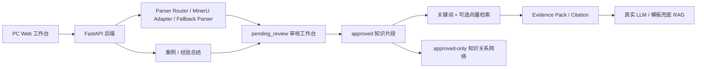

# PPT 素材：架构图说明

```mermaid
flowchart LR
  U["PC Web 工作台"] --> API["FastAPI 后端"]
  API --> Parser["Parser Router / MinerU Adapter / Fallback Parser"]
  Parser --> Review["pending_review 审核工作台"]
  Review --> Approved["approved 知识片段"]
  Approved --> Retrieval["关键词 + 可选向量检索"]
  Retrieval --> Evidence["Evidence Pack / Citation"]
  Evidence --> RAG["真实 LLM / 模板兜底 RAG"]
  API --> Cases["案例 / 经验总结"]
  Cases --> Review
  Approved --> Graph["approved-only 知识关系网络"]
```

## 要点

- 解析结果不直接进入正式知识库。
- 检索默认只检索 approved。
- LLM 失败时返回 evidence 与标准模板，不中断。
- LoongArch/Kylin 以目标环境实际验证为准。
