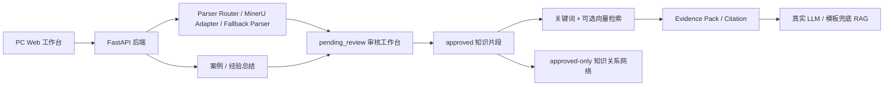

# PPT 素材：架构图说明

> [!WARNING]
> **历史快照（非现行基线）**：本文记录 2026 年前期竞赛原型、阶段调研、验证或交付准备，仅用于追溯当时事实。文内“当前”“最终”“正式”“已完成”“必须”“一键部署”等表述均限定于当时范围，不构成现行产品状态、开发顺序、生产要求或交付承诺。现行文档的适用范围和来源优先级只以[根 README](../../README.md)第 1 节为入口；需求语义、动态状态、公共契约、领域事件和变更证据分别遵循该节指向的唯一事实源。本文中的命令、测试数量和部署结论未经当前版本复验，不得作为当前验收证据。

## 要点

- 解析结果不直接进入正式知识库。
- 检索默认只检索 approved。
- LLM 失败时返回 evidence 与标准模板，不中断。
- LoongArch/Kylin 以目标环境实际验证为准。
