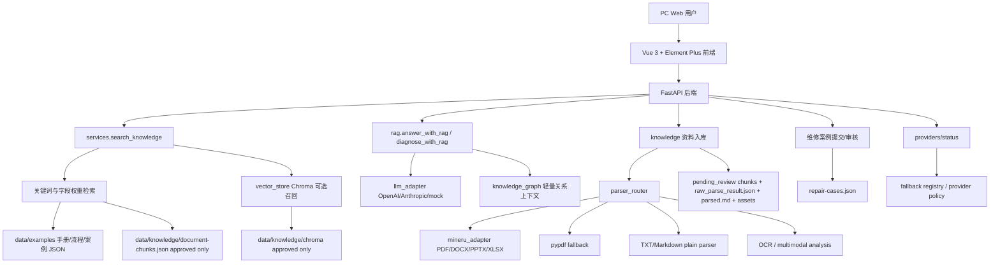

# 第一轮架构评估与开源借鉴计划

> [!WARNING]
> **历史快照（非现行基线）**：本文记录 2026 年前期竞赛原型、阶段调研、验证或交付准备，仅用于追溯当时事实。文内“当前”“最终”“正式”“已完成”“必须”“一键部署”等表述均限定于当时范围，不构成现行产品状态、开发顺序、生产要求或交付承诺。现行文档的适用范围和来源优先级只以[根 README](../../README.md)第 1 节为入口；需求语义、动态状态、公共契约、领域事件和变更证据分别遵循该节指向的唯一事实源。本文中的命令、测试数量和部署结论未经当前版本复验，不得作为当前验收证据。

日期：2026-06-16
范围：基于当前仓库代码、测试、样例数据和已验证部署记录，不重新解释项目背景，不做大重构。

## 本轮目标

1. 从真实代码判断当前“设备检修知识检索与作业辅助系统”的实现边界。
2. 对照准生产级目标，识别检索、入库、诊断、多模态、审核、引用和 fallback 的短板。
3. 调研成熟开源项目，筛出可直接借鉴的工程模块和不宜引入的重依赖。
4. 给出下一阶段最多 3 个高价值功能，并输出文件级修改计划。
5. 本轮只新增评估文档、评测模板和配置说明修正，不改运行时代码。

## 当前实现分析

### 当前架构图

### 真实链路

| 能力 | 当前真实实现 | 已覆盖测试/证据 | 主要短板 |
| --- | --- | --- | --- |
| 文档入库 | `parser_router -> mineru_adapter` 优先处理 PDF/DOCX/PPTX/XLSX；TXT/Markdown 纯文本；图片进入 OCR/多模态入口；解析产物保存到 `data/knowledge/parsed/<doc_id>/` | `test_knowledge_document_upload_creates_pending_review_chunks_and_parse_artifacts`、官方 PDF 测试 | 解析任务仍是同步接口；Office fallback 不产生可信 chunk；缺少解析质量评分 |
| pending_review 审核门槛 | 上传、OCR、多模态生成的 document chunks 默认 `review_status=pending_review`；search/vector 只使用 approved | `test_knowledge_document_upload_does_not_sync_pending_chunks_to_vector_store`、Chroma citations 测试 | 资料 chunk 还没有统一 approve/reject 工作台；状态机不完整 |
| 检索 | 手册、已审核案例、approved document chunks 走关键词/字段权重；Chroma 可选向量召回后合并 | `test_search_with_chroma_enabled_merges_vector_results` | 还不是清晰的 normalization -> metadata filter -> keyword/vector -> RRF -> rerank -> evidence pack |
| RAG | `/api/rag/answer` 复用 search 结果，构造上下文，调用 OpenAI/Anthropic 或 mock；失败回退 mock | 多个 provider fallback/真实 provider 小样本测试 | 输出不是强结构化“初步判断/检查步骤/维修步骤/安全提醒/验收标准/引用证据/不确定信息” |
| 故障诊断 | `/api/diagnosis` 复用检索和 RAG，返回可能原因、建议动作、安全提示、citations | `test_diagnosis_reuses_search_and_rag_citations` | 诊断结果还不是 Pydantic 结构化 schema；风险等级和人工复核规则弱 |
| 多模态/OCR | `multimodal_adapter` 支持 mock/openai/anthropic/local，`ocr_adapter` 支持 mock/rapidocr/tesseract/off；结果生成待审核 chunk | 多模态 mock、OCR 状态测试 | 默认仍是 mock；真实 OCR/多模态依赖在 LoongArch/Kylin 未完整验收 |
| 案例审核 | 维修案例提交为 `pending_review`，approve 后进入检索；reject 不参与检索 | `test_case_submit_review_and_search_round_trip` | 审核记录字段弱，缺 reviewer/review_time/action 标准日志；资料审核未统一 |
| citations | RAG citations 从检索上下文生成，document result 保留 `documentId/chunkId/page/section` 部分字段 | Chroma citation 保留 documentId 测试 | citation/evidence pack 字段未统一；证据不足判断弱 |
| fallback | LLM、embedding、OCR、Chroma、MinerU 均有 mock/off/hash/关键词兜底 | provider status 和 fallback 测试 | fallback 原因缺少统一审计页和历史记录 |

### 当前数据形态

| 数据 | 文件/目录 | 状态 |
| --- | --- | --- |
| 种子设备 | `data/examples/devices.json` | 6 类示例设备/系统 |
| 种子手册 | `data/examples/manuals.json` | 8 条手册片段，含 `deviceModel/page/chapter/workflowId` |
| 种子流程 | `data/examples/workflows.json` | 6 条标准化作业流程 |
| 维修案例 | `data/examples/repair-cases.json` | approved 与 pending_review 混合 |
| 上传资料 | `data/knowledge/documents.json`、`document-chunks.json`、`revisions.json` | 运行期生成，默认不提交 |
| 向量索引 | `data/knowledge/chroma` | 运行期生成，默认不提交 |

## 参考的成熟开源项目

| 项目 | 可参考能力 | 许可证/来源 | 本项目结论 |
| --- | --- | --- | --- |
| RAGFlow | 深度文档理解、模板化 chunk、可视化切片干预、可追溯 citations、多路召回融合重排 | Apache-2.0；仓库说明支持复杂格式、traceable citations、multiple recall + fused reranking | 借鉴 ingestion + evidence + review UX，不引入整套服务 |
| Haystack | 显式 Pipeline/Component 思路、retriever/ranker/generator 解耦、生产可观测性 | Apache-2.0 | 借鉴 pipeline 分层命名，不引入框架运行时 |
| LlamaIndex | Node/metadata、reader/index/retriever、评估和 integration 生态 | MIT | 借鉴 metadata schema 和 ingestion/retrieval 抽象，不引入全套依赖 |
| Open WebUI | 本地/云端模型统一入口、管理型 Web UI、知识库交互 | 需以仓库当前 license 为准，注意其商业/再分发条款变化 | 只参考 provider 配置和状态展示，不复用 UI 或后端 |
| Qdrant | payload filter、dense/sparse/multivector、RRF/DBSF、生产级向量服务 | Apache-2.0 | 后续作为 Chroma 升级路径；第一阶段只借鉴 payload filter + RRF 设计 |
| LangGraph | 有状态工作流、节点间状态转移、可恢复 agent 流程 | MIT | 后续用于解析/审核/诊断编排；当前阶段不引入 |
| PydanticAI | typed agent output、Pydantic schema 驱动结果校验 | MIT | 借鉴结构化输出校验思路；先用现有 Pydantic schema 实现 |
| Ragas | RAG 评测集、faithfulness、answer relevancy、context precision/recall | Apache-2.0 | 第一阶段优先借鉴评测指标和数据格式 |
| DeepEval | 类 pytest 的 LLM/RAG 测试、RAG metrics、CI 集成 | Apache-2.0 | 借鉴 eval runner 和 CI 门槛；先做轻量自研 runner |
| PaddleOCR | 中文 OCR、文档结构化、PP-OCR/PP-Structure/PaddleOCR-VL | Apache-2.0 | 作为增强 OCR provider 候选；依赖重，LoongArch 单独验收 |
| MinerU | PDF/Office/Image 到 Markdown/JSON，复杂文档解析，PPTX/XLSX 原生支持 | 仓库展示为 View license，需复核具体 license；依赖重 | 已接入 adapter；继续保持可选主解析链路 + fallback |
| Docling | 多格式文档解析、Markdown/JSON 导出、本地执行、OCR、GenAI 集成 | MIT，模型另看各自 license | 作为 MinerU 替代/兜底 adapter 候选，不进入第一阶段主链路 |

## 借鉴内容

| 借鉴项 | 来源项目 | 落地方式 | 优先级 |
| --- | --- | --- | --- |
| RAG eval dataset 与指标口径 | Ragas、DeepEval | 新增 `data/evaluation/rag-eval-template.json`，后续加轻量 runner | P0 |
| 检索流程显式化 | RAGFlow、Haystack、Qdrant | 新建 `retrieval_pipeline` 小模块，保留 `services.search_knowledge` 对外 API | P0 |
| metadata filter | Qdrant、LlamaIndex | 对 `deviceModel/faultCode/component/knowledgeType/review_status` 做前置过滤 | P0 |
| RRF 结果融合 | Qdrant、RAGFlow | keyword/vector 分别排名，按 RRF 合并去重，保留 score breakdown | P0 |
| evidence pack | RAGFlow、DeepEval | 每条 evidence 标准化 `chunk_id/source_doc_id/version/page/section` | P0 |
| 结构化 RAG 输出 | PydanticAI、DeepEval | 现有 Pydantic schema + fallback 模板，不直接接 PydanticAI | P1 |
| parser adapter 形态 | MinerU、Docling、PaddleOCR | 保持 adapter + fallback，不让重依赖进入最小启动链路 | P1 |
| 状态页/配置可观测 | Open WebUI、RAGFlow | 扩展 `/api/providers/status` 和前端状态页 | P1 |

## 未采用内容及原因

| 不采用内容 | 原因 |
| --- | --- |
| 直接引入 RAGFlow/Haystack/LlamaIndex 作为主框架 | 会推翻当前 FastAPI/Vue/JSON/Chroma 小闭环，迁移成本高，比赛阶段风险大 |
| 立刻替换 Chroma 为 Qdrant | 当前 Chroma 已能完成 approved-only 语义召回；Qdrant 需要服务部署、备份、权限和 LoongArch 验收 |
| 立刻引入 LangGraph | 当前主要瓶颈是检索、证据和审核，不是 agent 编排；过早引入会扩大状态复杂度 |
| 立刻引入重排模型 | reranker 会增加模型下载、推理耗时和国产化验收成本；第一阶段先做 RRF 和 evidence sufficiency |
| 直接用 PaddleOCR-VL/Docling 取代 MinerU | MinerU adapter 已接入主链路；Docling/PaddleOCR 更适合作为后续替代 provider |
| 把 hash embedding 当生产语义向量 | hash 只是断网/无 Key fallback，不能用于生产级语义质量承诺 |

## 许可证和依赖风险

| 项目 | 许可证风险 | 依赖/部署风险 | LoongArch/Kylin 风险 |
| --- | --- | --- | --- |
| RAGFlow | Apache-2.0 友好 | 服务大、依赖多、Docker 镜像重 | 官方预构建偏 x86，国产化需源码/容器专项验证 |
| Haystack | Apache-2.0 友好 | 框架依赖可控，但全量引入会扩大测试面 | Python 依赖需逐项验证 |
| LlamaIndex | MIT 友好 | integration 生态很大，容易隐式拉重依赖 | 需按所选 integration 验证 |
| Open WebUI | license 需按当前仓库复核，不建议复用代码 | Web 服务和数据库迁移成本高 | 容器/依赖需要专项验证 |
| Qdrant | Apache-2.0 友好 | 需要独立服务、数据备份、权限、监控 | Rust 服务在 LoongArch 上需构建/运行验证 |
| LangGraph | MIT 友好 | 需要引入 LangChain 生态和工作流状态持久化 | Python 依赖可测，但不是当前最小路径 |
| PydanticAI | MIT 友好 | 与现有 Pydantic/FastAPI 可兼容，但会引入 agent 运行时 | 风险中等，可后置 |
| Ragas | Apache-2.0 友好 | LLM-as-judge 依赖真实模型，离线评测需替代指标 | 作为开发评测工具即可，不进生产最小链路 |
| DeepEval | Apache-2.0 友好 | 默认可能建议云端平台，需关闭上传/登录依赖 | 本地测试工具可用性需单独验证 |
| PaddleOCR | Apache-2.0 友好 | 模型与推理后端重，下载大 | LoongArch 上 Paddle/ONNX/加速后端需专项验证 |
| MinerU | 需复核仓库具体 license 和模型 license | Torch/OpenCV/Gradio 等依赖重，首次安装慢 | 已知未完整验收，必须保留 fallback |
| Docling | MIT 友好，模型另算 | 解析能力强但依赖不轻 | 需在 Kylin/LoongArch 单独安装验证 |

## 修改文件

本轮实际修改：

| 文件 | 类型 | 目的 |
| --- | --- | --- |
| `.env.example` | 配置模板 | 移除未被代码读取的 `DATABASE_URL/UPLOAD_DIR`，补齐 `APP_*` 数据目录 |
| `docs/design/api-contract-draft.md` | 文档修正 | 修正“纯关键词、不引入向量库”的过期描述 |
| `docs/deployment/deployment-guide.md` | 文档修正 | 对齐 Chroma、MinerU、OCR、APP_* 配置和 LoongArch 风险口径 |
| `docs/deployment/local-development-environment.md` | 文档修正 | 去掉 SQLite 必备项，补齐当前 JSON/Chroma/OCR/MinerU 环境变量 |
| `docs/project-management/agent-startup-context.md` | 交接修正 | 更新日期、embedding 模型名和 LoongArch 边界 |
| `docs/project-management/current-handoff.md` | 交接修正 | 修正 embedding 模型名 |
| `docs/research/first-round-architecture-assessment-2026-06-16.md` | 新增文档 | 本轮架构评估和开源借鉴计划 |
| `data/evaluation/rag-eval-template.json` | 新增评测模板 | 后续 RAG/检索评测基线数据 |

下一阶段建议修改：

| 文件 | 计划改动 |
| --- | --- |
| `backend/app/retrieval_pipeline.py` | 新增 query normalization、metadata filter、keyword/vector retrieval、RRF fusion、evidence pack |
| `backend/app/services.py` | 保持 `/api/search` 入参出参，内部调用 retrieval pipeline |
| `backend/app/schemas.py` | 新增 Evidence、RagStructuredAnswer、RetrievalDiagnostics schema |
| `backend/app/llm_adapter.py` | 输出固定检修建议结构，LLM 失败返回模板和 evidence |
| `backend/app/rag.py` | 接 evidence pack 和 evidence sufficiency |
| `frontend/src/api.ts` | 补齐 evidence/diagnostics 类型 |
| `frontend/src/components/ResultsPanel.vue` | 增加 evidence card 展示 |
| `frontend/src/components/RagPanel.vue` | 展示结构化检修建议和不确定信息 |
| `tests/test_retrieval_pipeline.py` | 新增 RRF、metadata filter、fallback 单测 |
| `tests/test_rag_evaluation.py` | 新增 eval template 可加载、字段完整性、离线基线测试 |

## 具体实现

### 第一阶段最多 3 个高价值功能

1. RAG/检索评测基线
   新增 eval dataset 和轻量 runner，覆盖型号精确匹配、故障码/部件、语义描述、安全提醒、证据不足、pending_review 不可检索、Chroma fallback。这个任务最小、价值最高，可以防止后续优化靠主观感觉。

2. 混合检索 v2
   在不改外部 API 的前提下，把当前 `services.search_knowledge()` 内部逻辑拆成清晰流程：query normalization -> metadata filter -> keyword retrieval -> vector retrieval -> RRF fusion -> evidence pack。先不接重排模型。

3. Evidence sufficiency + 结构化 RAG 输出
   RAG 输出固定为“初步判断、建议检查步骤、建议维修步骤、安全提醒、验收标准、引用证据、不确定信息”。证据不足时返回“不确定”，high/critical 风险提示人工复核；LLM 失败时返回 evidence + 模板，不中断。

### 不变边界

1. 不改当前 FastAPI 路由 URL。
2. 不删除 JSON 存储和 mock fallback。
3. 不把 pending_review 片段同步到 Chroma。
4. 不把 MinerU/OCR/Chroma/真实 LLM 变成最小部署必需项。
5. 不直接引入 RAGFlow/Haystack/LlamaIndex/LangGraph 等框架运行时。

## 测试结果

本轮新增的是评估文档和评测模板，运行时代码未修改。验证策略：

1. `git diff --check`：通过，仅有 Git 的 CRLF 提示。
2. `Get-Content -Raw -Encoding UTF8 data\evaluation\rag-eval-template.json | ConvertFrom-Json`：通过，`schema_version=0.1.0`。
3. `$env:MINERU_ENABLED='false'; .\backend\.venv\Scripts\python.exe -m pytest tests/ -q`：通过，`92 passed in 21.06s`。
4. `npm.cmd run build`：通过，保留既有 Rollup 注释 warning 和 chunk size warning。

补充说明：直接启用当前环境里的真实 MinerU 跑全量单测时，官方大 PDF 解析用例会被重依赖解析拖慢并触发超时；单元测试基线应显式关闭 MinerU 或后续给真实 MinerU 样本测试加 slow/integration 标记。

## 国产化和离线影响

1. 本轮不增加新的运行时依赖，国产化部署风险不扩大。
2. `.env.example` 更贴近最小离线部署：mock LLM、多模态/OCR fallback、APP_* JSON 数据目录、Chroma 可关闭。
3. RAG eval template 是纯 JSON，可离线使用。
4. 后续混合检索 v2 仍以关键词和 hash fallback 保底，Chroma/embedding 不可用时不影响基本检索。
5. MinerU、PaddleOCR、Docling、Qdrant 都必须保留“增强依赖单独验收”的边界。

## 已知问题

1. 资料 chunk 还没有统一 approve/reject 审核工作台。
2. 状态机还缺 `draft/rejected/deprecated/replaced` 的完整一致性。
3. 当前 RAG 输出不是强结构化 schema。
4. 当前检索融合是简单合并排序，不是 RRF。
5. 当前 evidence/citation 字段不够统一，证据不足判断弱。
6. JSON 存储仍缺生产级并发写保护，长期需 SQLite 或服务型数据库迁移。
7. 真实 MinerU/OCR/Chroma 在 LoongArch/Kylin 上仍需单独验收。

## 下一轮建议

1. 先实现 RAG eval runner，让每次检索改动都有 recall、citation、fallback、evidence sufficiency 基线。
2. 再抽 `retrieval_pipeline.py`，把现有检索改造成显式流程并加入 RRF。
3. 然后做结构化 RAG 输出和 evidence cards，提升生产场景可信度。

## 参考链接

1. RAGFlow: <https://github.com/infiniflow/ragflow>
2. Haystack: <https://github.com/deepset-ai/haystack>
3. LlamaIndex: <https://github.com/run-llama/llama_index>
4. Open WebUI: <https://github.com/open-webui/open-webui>
5. Qdrant: <https://github.com/qdrant/qdrant>
6. LangGraph: <https://github.com/langchain-ai/langgraph>
7. PydanticAI: <https://github.com/pydantic/pydantic-ai>
8. Ragas: <https://github.com/explodinggradients/ragas>
9. DeepEval: <https://github.com/confident-ai/deepeval>
10. PaddleOCR: <https://github.com/PaddlePaddle/PaddleOCR>
11. MinerU: <https://github.com/opendatalab/MinerU>
12. Docling: <https://github.com/docling-project/docling>
