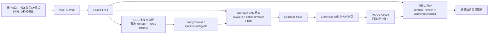

# 软件功能设计文档

项目名称：设备检修知识检索与作业辅助系统
版本日期：2026-06-27

## 1. 总体设计

系统采用前后端分离设计。前端为 Vue 3 + Element Plus PC Web 工作台，后端为 FastAPI 服务。业务数据采用 JSON 文件存储并使用原子写入和 `.bak` 备份机制。检索默认使用 approved-only 轻量检索链路，向量增强为可选能力。

## 2. 系统架构图



## 3. 主要业务流程

1. 检索诊断：输入设备型号、故障描述、检修等级，返回 approved 证据。
2. 图片诊断：上传故障图片，生成 OCR 文本、视觉症状、识别部件和图片线索，合并到 queryContext 后检索。
3. RAG 作业指引：基于 Evidence Pack 输出结构化检修建议。
4. 资料入库：上传资料，解析结果进入 pending_review。
5. 知识沉淀：提交案例、经验总结或 RAG 回答修正，审核通过后进入知识关系网络。

## 4. 前端模块设计

| 模块 | 文件 | 职责 |
|---|---|---|
| 检索诊断面板 | `QueryPanel.vue` | 设备型号、故障描述、检修等级、资料上传、图片诊断和跨模态线索展示 |
| 检索结果面板 | `ResultsPanel.vue` | 展示证据结果、来源、命中原因和 score breakdown |
| RAG 面板 | `RagPanel.vue` | 生成结构化建议、展示 Evidence Pack、提交回答修正 |
| 资料面板 | `KnowledgePanel.vue` | 资料上传、解析状态、资产分析状态、chunk 修正和审核 |
| 审核面板 | `ReviewPanel.vue` | 案例、资料片段、RAG feedback 的审核入口 |
| 知识关系网络 | `KnowledgeGraphPanel.vue` | 展示 query/global 图谱节点与关系 |

## 5. 后端模块设计

| 模块 | 文件 | 职责 |
|---|---|---|
| API 入口 | `backend/app/main.py` | FastAPI 路由与请求编排 |
| schema | `backend/app/schemas.py` | 请求模型和校验 |
| 检索 | `backend/app/retrieval/` | query normalization、keyword/vector、fusion、evidence |
| RAG | `backend/app/rag.py` | 检索、Evidence Pack、LLM/mock 回答 |
| Evidence Pack | `backend/app/evidence_pack.py` | 证据标准化和结构化输出 |
| 资料入库 | `backend/app/knowledge.py` | parser、chunk、review、revision、asset analysis |
| JSON 存储 | `backend/app/data_store.py` | 示例数据、知识数据、RAG feedback 原子读写 |
| 知识关系网络 | `backend/app/knowledge_graph.py` | approved-only 节点和关系构建 |

## 6. API 设计

| API | 说明 |
|---|---|
| `GET /api/health` | 健康检查 |
| `GET /api/providers/status` | Provider 与 fallback 状态 |
| `POST /api/search` | approved-only 检索 |
| `POST /api/rag/answer` | 结构化 RAG 作业指引 |
| `POST /api/multimodal/diagnosis` | 图片诊断和跨模态线索匹配 |
| `POST /api/rag/feedback` | 提交 RAG 回答标注/修正 |
| `GET /api/rag/feedback` | 查询 feedback |
| `PATCH /api/rag/feedback/{id}/review` | 审核 feedback |
| `POST /api/cases` | 提交案例/经验总结 |
| `GET /api/review/items` | 审核工作台 |
| `GET /api/knowledge/graph` | 全局知识关系网络 |

## 7. 数据结构设计

核心对象包括 device、manual、workflow、case、document、chunk、review event、knowledge revision、rag feedback 和 graph node/edge。所有可进入检索或知识关系网络的业务对象均携带审核状态。

RAG feedback 结构包含：

```json
{
  "id": "ragfb-xxxx",
  "deviceModel": "",
  "faultText": "",
  "maintenanceLevel": "",
  "originalAnswer": "",
  "correctedAnswer": "",
  "labels": [],
  "reason": "",
  "status": "pending_review",
  "reviewer": "operator"
}
```

## 8. RAG / Evidence Pack 设计

检索结果经 Evidence Pack 标准化后传入 RAG。Evidence Pack 保留 `chunkId/sourceDocId/page/section/version/reviewStatus`，RAG 输出必须基于 evidence，证据不足时明确不确定。

## 9. 多模态诊断设计

图片诊断不直接生成正式证据，而是生成 `multimodalSignals`：

- OCR 文本
- 图片线索
- 识别部件
- 视觉症状
- matchedQueryTerms
- signalSource
- fallback
- matchMode

这些线索合并到 queryContext，增强 approved-only 检索。citation 的 `scoreBreakdown` 增加 `crossModalMatchMode=semantic_clue_to_text_retrieval`。

## 10. 审核状态机设计

状态包括 `draft/pending_review/approved/rejected/deprecated/replaced`。默认检索、Evidence Pack 和知识关系网络只接收 approved 对象。拒绝必须记录原因，修正必须生成 revision 或 review event。

## 11. 知识关系网络设计

当前实现为轻量知识关系网络 / 知识图谱原型。节点包含 device、fault、manual、case、document、chunk、workflow、term、provider、rag_feedback。关系包括证据支持、适用资料、案例证据、修正建议、包含术语等。

## 12. RAG feedback / 回答修正设计

用户在 RAG 面板提交 correctedAnswer、labels、reason 和 reviewer。记录默认 pending_review；审核通过后作为 `rag_feedback` 节点进入知识关系网络，但不直接进入 RAG 检索索引，避免污染正式证据链。

## 13. Fallback 设计

无外网、无 Key、无真实 OCR、多模态 provider 不可用、向量增强不可用时，系统使用 mock/offline、hash embedding、SQLite python_scan 和模板化 RAG 兜底，保证演示主链路不断。

## 14. LoongArch 适配设计

默认依赖避免 native-heavy 包成为硬要求。Docker 或 venv 部署均采用 FastAPI + Vue 静态文件方案。Chroma、Qdrant、sqlite-vec、MinerU、真实 OCR 和真实多模态模型均为可选增强，必须目标环境验证后再启用。
